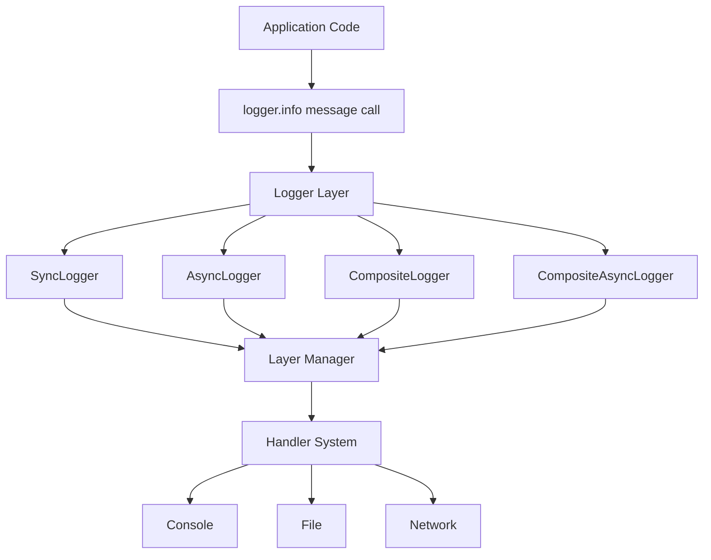
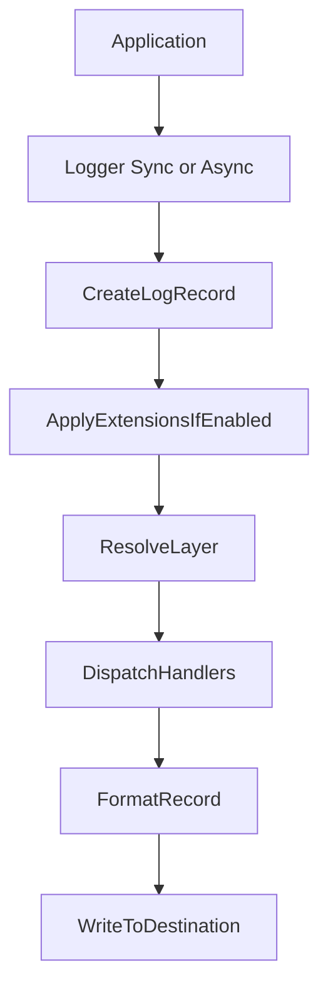

# HYDRA-LOGGER

A dynamic, scalable, event-oriented logging system built with KISS (Keep It Simple) principles: modular, zero-overhead when disabled, and extension-based.

**Features**: Multi-layer logging • Sync/Async/Composite loggers • Multiple formats (JSON, plain-text, colored) • Multiple destinations (console, file, network) • Extension system • Zero overhead when disabled

---

## 🎯 Core Principles

* **KISS** — simple, maintainable code; avoid over-engineering.
* **Event-Oriented** — direct method calls, loose coupling, async-ready.
* **Zero Overhead Extensions** — default disabled; no runtime cost when off.
* **Standardization** — consistent names, file patterns, method signatures, and configuration.

---

## 🏗 Architecture Overview

**Core Package**: Modular package under `hydra_logger/`  
**Architecture**: Event-oriented, modular, scalable, user-controllable  
**Design Principles**: KISS, event-oriented, zero overhead, consistent naming  
**User Control**: Full control over formats, destinations, configurations, and extensions

### High-Level Architecture



### Data Flow



**Simplified Data Flow:**

```
Application
   ↓
Logger (Sync / Async)
   - Create LogRecord
   - Apply extensions
   - Route to layer
   ↓
LayerManager
   - Resolve layer
   - Fallback logic
   ↓
Handler(s)
   - Check level
   - Format record (internal)
   - Write to destination
```

> 📖 **Detailed Documentation**: For comprehensive workflow details, see [WORKFLOW_ARCHITECTURE.md](docs/WORKFLOW_ARCHITECTURE.md)
> 📚 **Module Documentation**: For package-by-package docs and maintenance workflow, see [docs/modules/README.md](docs/modules/README.md)

---

## 🎛️ User Control System

Users have full control over all aspects of the logging system:

### **1. FORMAT CONTROL**
```python
# Users can choose any format for any destination
config = LoggingConfig(
    layers={
        "app": LogLayer(
            destinations=[
                LogDestination(type="console", format="json", use_colors=True),
                LogDestination(type="file", path="app.log", format="plain-text"),
                LogDestination(type="file", path="app_structured.jsonl", format="json-lines")
            ]
        )
    }
)
```

### **2. DESTINATION CONTROL**
```python
# Users can choose any destination combination
config = LoggingConfig(
    layers={
        "api": LogLayer(
            destinations=[
                LogDestination(type="console", format="colored"),
                LogDestination(type="file", path="api.log", format="json-lines")
            ]
        )
    }
)
```

### **3. EXTENSION CONTROL**
```python
# Users can enable/disable and configure any extension
config = LoggingConfig(
    extensions={
        "security": {
            "enabled": True,
            "type": "security",
            "patterns": ["email", "phone", "api_key"]
        }
    }
)
```

---

## 🚀 Quick Start

### Installation

```bash
pip install hydra-logger
```

### Development Environment (Conda)

```bash
conda env create -p ./.hydra_env -f environment.yml
source "$(conda info --base)/etc/profile.d/conda.sh"
conda activate "$(pwd)/.hydra_env"
```

For update, lockfile, and troubleshooting workflows, see `docs/ENVIRONMENT_SETUP.md`.

### Basic Usage

```python
from hydra_logger import LoggingConfig, LogLayer, LogDestination, create_logger

# Configure logger
config = LoggingConfig(
    layers={
        "app": LogLayer(
            destinations=[
                LogDestination(type="console", format="colored", use_colors=True),
                LogDestination(type="file", path="app.log", format="json-lines")
            ]
        )
    }
)

# Use context manager for automatic cleanup
with create_logger(config, logger_type="sync") as logger:
    logger.info("Application started", layer="app")
    logger.warning("Low memory", layer="app")
    logger.error("Database connection failed", layer="app")
```

### Async Usage

```python
from hydra_logger import create_async_logger
import asyncio

async def main():
    async with create_async_logger("MyAsyncApp") as logger:
        await logger.info("Async logging works")
        await logger.warning("Async warning message")

asyncio.run(main())
```

---

## ✨ Key Features

### Multiple Logger Types
- **SyncLogger**: Synchronous logging with immediate output
- **AsyncLogger**: Asynchronous logging with queue-based processing
- **CompositeLogger**: Composite pattern for multiple logger components
- **CompositeAsyncLogger**: Async version of composite logger

### Multi-Layer Support
- Independent logging layers with different configurations
- Layer-specific level thresholds
- Automatic fallback to default layer

### Flexible Output Formats
- **Plain Text**: Clean, readable output
- **JSON Lines**: Structured logging (one JSON per line)
- **Colored**: ANSI color codes for console output
- **Structured**: CSV, Syslog, GELF, Logstash formats

### Multiple Destinations
- **Console**: stdout/stderr with color support
- **File**: Local file storage with rotation
- **Network**: HTTP, WebSocket, Socket protocols
- **Null**: no-op sink for silencing or testing flows

### Extension System
- **Security**: Data redaction and sanitization
- **Performance**: Performance monitoring
- Zero overhead when disabled
- Runtime enable/disable

### Performance Optimizations
- Buffer-based batching (5K-50K messages)
- Handler and layer caching
- Pre-compiled JSON encoder
- Async queue processing with overflow handling

---

## 📚 Documentation

- **[WORKFLOW_ARCHITECTURE.md](docs/WORKFLOW_ARCHITECTURE.md)** - Complete workflow and data flow details
- **[ARCHITECTURE.md](docs/ARCHITECTURE.md)** - Detailed package structure and component breakdown
- **[Module Docs Index](docs/modules/README.md)** - Canonical module-by-module documentation
- **[Plans](docs/plans/)** - Execution plans and delivery intent
- **[Audit Results](docs/audit/)** - Audit evidence, matrices, and alignment tracking
- **[PERFORMANCE.md](docs/PERFORMANCE.md)** - Performance benchmarks and optimization details
- **[CHANGELOG.md](CHANGELOG.md)** - Recent updates and migration history
- **[Examples](examples/)** - 16 working examples demonstrating all features

---

## 📋 Examples

All examples are available in the `examples/` directory:

```bash
# Run all examples
python3 examples/run_all_examples.py

# Run individual examples
python3 examples/11_quick_start_basic.py      # Basic usage
python3 examples/12_quick_start_async.py     # Async usage
python3 examples/06_basic_colored_logging.py # Colored logging
python3 examples/16_multi_layer_web_app.py   # Multi-layer web application
```

See [examples/README.md](examples/README.md) for a complete list of all 16 examples.

---

## 🧪 Testing

```bash
# Environment preflight (recommended before quality gates)
python scripts/dev/check_env_health.py --strict

# Canonical test gate
python -m pytest -q

# Run all examples (includes verification)
python3 examples/run_all_examples.py

# Run performance benchmarks
python3 performance_benchmark.py
```

Use the Conda `.hydra_env` workflow from `docs/ENVIRONMENT_SETUP.md` before running these commands.

---

## 🤝 Contributing

* Follow KISS principles and naming standards
* Add tests for each new change
* Update documentation for any behavior or API changes
* Use `pre-commit` (formatting, linter) and run full test suite locally before PR
* Local agent governance is maintained in `AGENTS.md` (local-only, ignored)

---

## 📄 License

MIT — see `LICENSE`.

---

## 🔗 Links

- **GitHub**: [SavinRazvan/hydra-logger](https://github.com/SavinRazvan/hydra-logger)
- **Documentation**: See `docs/` directory
- **Examples**: See `examples/` directory
