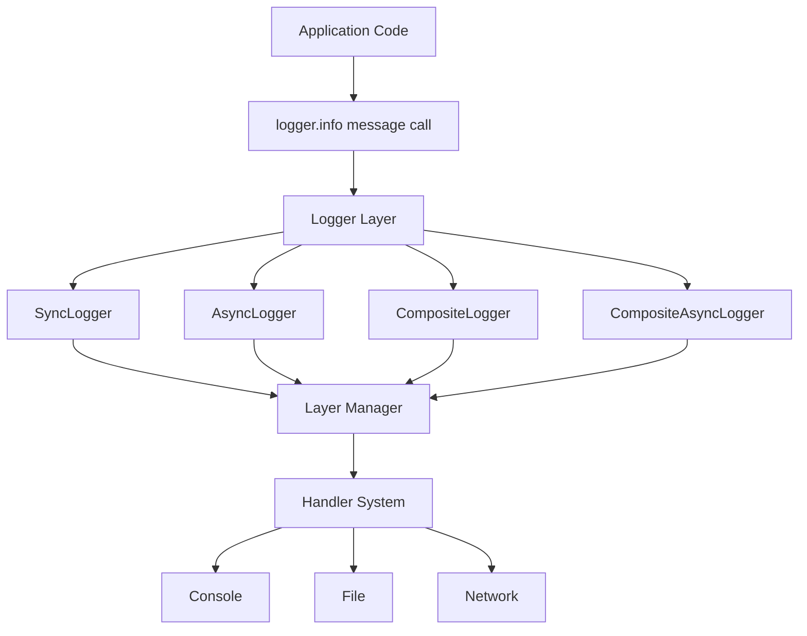

# HYDRA-LOGGER

`hydra-logger` is a modular Python logging library for teams that need configurable logging without coupling application code to fixed transports or formats.

## Overview

Core capabilities:
- Sync, async, and composite logger types
- Layer-based routing with per-layer destinations and levels
- Console, file, network, and null handlers
- Plain text, colored, JSON lines, and structured formats
- Optional extensions (for example security and performance)

Design principles:
- Keep implementation simple and maintainable
- Favor configuration over hardcoded behavior
- Keep module boundaries explicit and extensible

## Install

```bash
pip install hydra-logger
```

Development environment:

```bash
# Option A (venv)
python3 -m venv .hydra_env
source .hydra_env/bin/activate
python -m pip install --upgrade pip setuptools wheel
python -m pip install -e .[dev]
python -m pip install pyright

# Option B (Conda prefix)
conda env create -p ./.hydra_env -f environment.yml
source "$(conda info --base)/etc/profile.d/conda.sh"
conda activate "$(pwd)/.hydra_env"
```

Environment maintenance and troubleshooting are documented in `docs/ENVIRONMENT_SETUP.md`.

## Quick Start

```python
from hydra_logger import LoggingConfig, LogLayer, LogDestination, create_logger

config = LoggingConfig(
    layers={
        "app": LogLayer(
            destinations=[
                LogDestination(type="console", format="colored", use_colors=True),
                LogDestination(type="file", path="app.log", format="json-lines"),
            ]
        )
    }
)

with create_logger(config, logger_type="sync") as logger:
    logger.info("Application started", layer="app")
    logger.warning("Low memory", layer="app")
    logger.error("Database connection failed", layer="app")
```

Async variant:

```python
import asyncio
from hydra_logger import create_async_logger


async def main():
    async with create_async_logger("MyAsyncApp") as logger:
        await logger.info("Async logging works")
        await logger.warning("Async warning message")


asyncio.run(main())
```

## Configuration

Format configuration:

```python
config = LoggingConfig(
    layers={
        "app": LogLayer(
            destinations=[
                LogDestination(type="console", format="json", use_colors=True),
                LogDestination(type="file", path="app.log", format="plain-text"),
                LogDestination(type="file", path="app_structured.jsonl", format="json-lines"),
            ]
        )
    }
)
```

Destination configuration:

```python
config = LoggingConfig(
    layers={
        "api": LogLayer(
            destinations=[
                LogDestination(type="console", format="colored"),
                LogDestination(type="file", path="api.log", format="json-lines"),
            ]
        )
    }
)
```

Extension configuration:

```python
config = LoggingConfig(
    extensions={
        "security": {
            "enabled": True,
            "type": "security",
            "patterns": ["email", "phone", "api_key"],
        }
    }
)
```

## Architecture

System flow (high-level):



Detailed architecture and workflow documentation:
- `docs/ARCHITECTURE.md`
- `docs/WORKFLOW_ARCHITECTURE.md`
- `docs/modules/README.md`

## Operations

Quality and validation commands:

```bash
# Environment preflight
python scripts/dev/check_env_health.py --strict

# Test gate
python -m pytest -q

# Run all examples
python3 examples/run_all_examples.py

# Performance benchmark
python3 performance_benchmark.py
```

Selected examples:

```bash
python3 examples/11_quick_start_basic.py
python3 examples/12_quick_start_async.py
python3 examples/06_basic_colored_logging.py
python3 examples/16_multi_layer_web_app.py
```

## Documentation

- `docs/ARCHITECTURE.md`
- `docs/WORKFLOW_ARCHITECTURE.md`
- `docs/modules/README.md`
- `docs/PERFORMANCE.md`
- `docs/plans/`
- `docs/audit/`
- `CHANGELOG.md`
- `examples/README.md`

## Contributing

- Keep changes focused and maintain backward compatibility for public APIs
- Add or update tests in `tests/` for behavior changes
- Update docs when behavior or public interfaces change
- Run `pre-commit` and `python -m pytest -q` before opening a PR

## License

MIT. See `LICENSE`.
