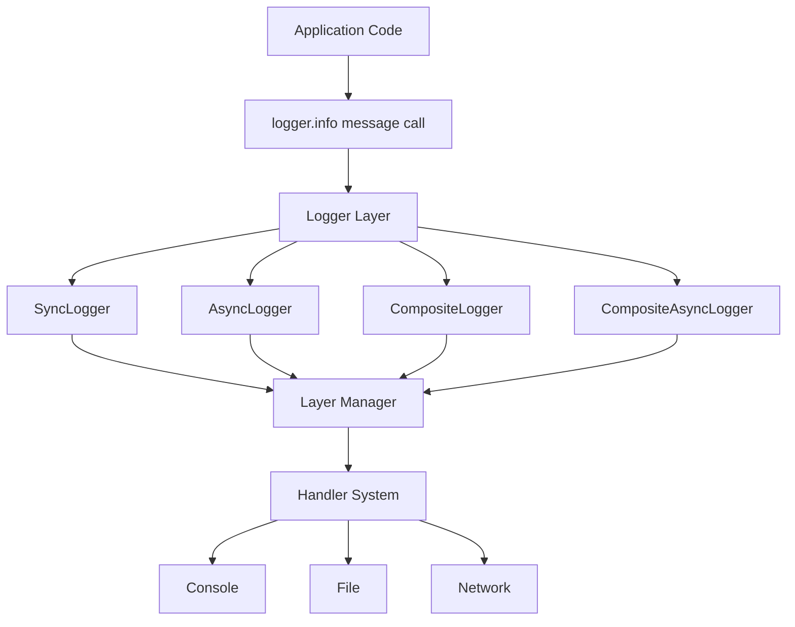

# HYDRA-LOGGER

[](https://github.com/SavinRazvan/hydra-logger/actions/workflows/ci.yml)
[](https://github.com/SavinRazvan/hydra-logger/blob/main/setup.py)
[](https://codecov.io/gh/SavinRazvan/hydra-logger)
[](https://github.com/SavinRazvan/hydra-logger/blob/main/LICENSE)
[](https://pypi.org/project/hydra-logger/)
[](https://pepy.tech/projects/hydra-logger)

`hydra-logger` is a modular Python logging library for teams that need configurable logging without coupling application code to fixed transports or formats.

Best fit:
- teams that need structured logging with strict reliability controls
- services that route logs by layer, destination, and policy
- organizations migrating from ad-hoc logging to consistent standards

## Overview

Core capabilities:
- Sync, async, and composite logger types
- Layer-based routing with per-layer destinations and levels
- Console, file, network, and null handlers
- Plain text, colored, JSON lines, and structured formats
- Optional extensions (for example security and performance)

Design principles:
- Keep implementation simple and maintainable
- Favor configuration over hardcoded behavior
- Keep module boundaries explicit and extensible

Quick links:
- [Environment setup](docs/ENVIRONMENT_SETUP.md)
- [Enterprise tutorials](examples/tutorials/README.md)
- [Configuration reference](docs/modules/config.md)
- [Operations diagnostics](docs/OPERATIONS.md)
- [Security policy](SECURITY.md)
- [Release policy & API compatibility](docs/RELEASE_POLICY.md)
- [Testing and quality gates](docs/TESTING.md)
- [Performance and benchmarks](docs/PERFORMANCE.md)
- [Documentation index — docs ↔ code alignment](docs/audit/DOCS_CODEBASE_ALIGNMENT.md)
- [Root package exports (detailed)](docs/modules/root-package.md)

## Public API snapshot

The **authoritative** top-level export list is `__all__` in [`hydra_logger/__init__.py`](hydra_logger/__init__.py). After changing exports, keep docs in sync:

```bash
python -c "import hydra_logger as h; print(sorted(h.__all__))"
```

| Group | Symbols |
| --- | --- |
| **Logger classes** | `SyncLogger`, `AsyncLogger`, `CompositeLogger`, `CompositeAsyncLogger` |
| **Factories** | `create_logger`, `create_sync_logger`, `create_async_logger`, `create_composite_logger`, `create_composite_async_logger` |
| **Logger managers** (stdlib-style) | `getLogger`, `getSyncLogger`, `getAsyncLogger` |
| **Configuration** | `LoggingConfig`, `LogLayer`, `LogDestination`, `ConfigurationTemplates`, `load_logging_config`, `clear_logging_config_cache` |
| **Core types** | `LogRecord`, `LogLevel`, `LogContext` |
| **Exceptions** | `HydraLoggerError`, `ConfigurationError`, `ValidationError`, `HandlerError`, `FormatterError`, `PluginError`, `SecurityError` |
| **Process controls** | `StderrInterceptor`, `start_stderr_interception`, `stop_stderr_interception` |
| **Metadata** | `__version__`, `__author__`, `__license__` |
| **Compatibility** | `HydraLogger` → `SyncLogger`, `AsyncHydraLogger` → `AsyncLogger` |

Submodule-specific surfaces (handlers, extensions, factories module, utils) live under [`docs/modules/README.md`](docs/modules/README.md).

## Enterprise adoption

- **Versioning & API stability**: follow [`docs/RELEASE_POLICY.md`](docs/RELEASE_POLICY.md); public contracts are documented exports and behaviors described in `README` / `docs/modules/`.
- **Configuration governance**: prefer **YAML** with `extends` for environment overlays; **JSON** is supported via the same loader (`yaml.safe_load`). Presets: [`examples/config/README.md`](examples/config/README.md).
- **Operational posture**: strict reliability, path confinement, health/diagnostics, and integration-only destinations are covered in [`docs/OPERATIONS.md`](docs/OPERATIONS.md) and the **Production operator baseline** section below.
- **Security**: report vulnerabilities per [`SECURITY.md`](SECURITY.md); treat regex redaction as **defense-in-depth**, not DLP (see `docs/OPERATIONS.md`).
- **Evidence & audits**: release checklists and alignment tracking in [`docs/RELEASE_CHECKLIST.md`](docs/RELEASE_CHECKLIST.md), [`docs/audit/`](docs/audit/README.md), and [`docs/audit/DOCS_CODEBASE_ALIGNMENT.md`](docs/audit/DOCS_CODEBASE_ALIGNMENT.md).

## Why Teams Choose Hydra-Logger

Hydra-Logger gives teams production-ready logging with clear defaults, strong
reliability controls, and high throughput.

- Built for real systems: sync, async, and composite logger runtimes
- Policy-driven routing: layers, per-destination levels, and typed network destinations
- Safety-first: strict reliability guards, path controls, and extension-based data protection
- Proven performance: benchmark profiles from quick **`pr_gate`** runs to heavy **`nightly_truth`** regression (see [`benchmark/README.md`](benchmark/README.md))

Latest snapshot (**`benchmark/results/benchmark_latest.json`**, produced with **`--profile pr_gate`** — ~97s wall on a 12-core Linux/WSL2 host, Python **3.12.3**, **5** repetitions where the profile uses them). **Authoritative** medians/p95/min/max: JSON **`repetition_stats`**; the lines below follow the printed / last-iteration summary for that run.

- **Individual loggers:** Sync **74,086** · Async **45,393** · Composite **55,809** · Composite async **57,128** msg/s
- **Batch:** Composite **103,213** (batch 200) · Composite async **515,232** (batch 50) msg/s
- **Preset configs:** Default **60,211** · Dev **66,666** · Prod **69,251** msg/s
- **File I/O:** Sync file **~30,068** msg/s (~10.3 MB/s) · Async file **~22,703** (~6.9 MB/s)
- **Memory (50 loggers):** ~**86.79** MB RSS (start/end), **0** MB reported increase
- **Concurrent (8 workers):** **408,907** msg/s aggregate (~330k–459k per worker in that run)
- **High-performance composite async:** **102,231** msg/s (30k msgs; 50k+ target met)

Reproduce: `.hydra_env/bin/python benchmark/performance_benchmark.py --profile pr_gate` (updates `benchmark_latest.json` and a timestamped JSON under `benchmark/results/`). For drift/reliability-style gates and long runs, use **`--profile nightly_truth`** (~1h+; documented in [`benchmark/README.md`](benchmark/README.md)). Human-readable rollup (when generated): [`benchmark/results/benchmark_latest_summary.md`](benchmark/results/benchmark_latest_summary.md).

Start quickly:

```bash
pip install hydra-logger
.hydra_env/bin/python examples/tutorials/cli_tutorials/t01_production_quick_start.py
```

Examples and tutorials:

- Tutorial tracks: [`examples/tutorials/README.md`](examples/tutorials/README.md)
- Full examples catalog: [`examples/README.md`](examples/README.md)
- Run examples individually with `.hydra_env/bin/python <script_path>`, or stream all CLI tutorials with
  `.hydra_env/bin/python examples/tutorials/shared/run_all_cli_tutorials.py`.
- **Notebooks** write under `examples/logs/notebooks/`; **CLI** tutorials under `examples/logs/cli-tutorials/`
  (representative outputs are **committed** as samples; other paths under `examples/logs/` stay ignored). Network tutorials may
  emit JSON artifacts there too (T12/T13 use **stub** transports; T14 uses **localhost** only).
- **Notebooks:** open from repo root or set `HYDRA_LOGGER_REPO`; see
  `examples/tutorials/notebooks/README.md`.
- **CI:** tutorial scripts and layout are covered by `tests/examples/` (`pytest tests/examples -q`).

## Install

```bash
pip install hydra-logger
```

### Core dependencies (always installed)

`pip` installs these from `setup.py` `install_requires` so a normal install is **complete
for the supported baseline API** (loggers, factories, YAML config loading, HTTP sinks,
async file paths, TOML helpers in `file_utility`, timestamps):

| Package | Role |
|--------|------|
| `pydantic` | `LoggingConfig` / validation |
| `PyYAML` | `load_logging_config`, safe YAML utilities |
| `aiofiles` | Async file handler I/O |
| `pytz` | Timezone-aware timestamps |
| `toml` | TOML read/write helpers in `utils.file_utility` |
| `requests` | `network_http` / batched HTTP (gracefully absent only if you strip deps manually) |

Nothing **new in v0.7.0** required changing this list: optional **real** WebSocket I/O
stays behind the **`network`** extra (`websockets`).

### Optional extras

Extras install bundles for integrations and tooling, for example:

```bash
pip install "hydra-logger[network]"
pip install "hydra-logger[perf]"
pip install "hydra-logger[database,cloud,queues]"
pip install "hydra-logger[full]"
```

Notes about extras:
- `network`: adds **`websockets`** for **real** WebSocket transport when you enable
  `use_real_websocket_transport` / `WebSocketHandler(..., use_real_websocket_transport=True)`.
  Other built-in network kinds (`network_http` with `requests`, socket/datagram, **simulated**
  WS) work with the core install as documented.
- `perf`: adds **`psutil`** for optional diagnostics hooks (also included in `dev`).
- `database`, `cloud`, `queues`, and `system` provide optional dependency bundles for advanced/custom integrations.

Development environment:

```bash
# Option A (venv)
python3 -m venv .hydra_env
source .hydra_env/bin/activate
python -m pip install --upgrade pip setuptools wheel
python -m pip install -e .[dev]
python -m pip install pyright

# Option B (Conda prefix)
conda env create -p ./.hydra_env -f environment.yml
source "$(conda info --base)/etc/profile.d/conda.sh"
conda activate "$(pwd)/.hydra_env"
```

Environment maintenance and troubleshooting are documented in `docs/ENVIRONMENT_SETUP.md`.

## Production operator baseline

Recommended starting posture for services where **lost or silent-dropped logs** matter:

- Enable **`strict_reliability_mode`** and set **`reliability_error_policy`** to `warn`
  or `raise` (see `docs/RELEASE_POLICY.md` and enterprise tutorials).
- Prefer **`performance_profile`** `minimal` or `balanced` on hot paths; keep
  `convenient` for diagnostics-heavy workloads (`docs/PERFORMANCE.md`).
- Treat **`async_cloud`** and similar schema-level destinations as **integration points**:
  core ships **no default sink**—wire a custom handler or expect `NullHandler` with
  policy-governed diagnostics (`docs/modules/config.md`, `docs/modules/handlers.md`).
- For **`network_ws`**, default remains **simulated**; opt into real I/O with
  `use_real_websocket_transport=True` on `WebSocketHandler` (or
  **`use_real_websocket_transport`** on the **`LogDestination`**) and the **`network`**
  extra (`websockets`).
- On shutdown, inspect **`get_health_status()`** for **`handler_close_failures`** /
  **`last_lifecycle_error`** when using strict reliability settings (`docs/OPERATIONS.md`).
- Do **not** rely on regex redaction as DLP—see `docs/OPERATIONS.md`.

Anti-patterns: assuming PyPI version matches a git checkout without running
`scripts/release/check_pypi_parity.py --require-match` after publish; enabling cloud
destinations without adapters; ignoring **INFO** logs from simulated `network_ws` when you meant to enable real transport.

## Quick Start

```python
from hydra_logger import LoggingConfig, LogLayer, LogDestination, create_logger

config = LoggingConfig(
    layers={
        "app": LogLayer(
            destinations=[
                LogDestination(type="console", format="colored", use_colors=True),
                LogDestination(type="file", path="app.log", format="json-lines"),
            ]
        )
    }
)

with create_logger(config, logger_type="sync") as logger:
    logger.info("Application started", layer="app")
    logger.warning("Low memory", layer="app")
    logger.error("Database connection failed", layer="app")
```

Async variant:

```python
import asyncio
from hydra_logger import create_async_logger


async def main():
    async with create_async_logger("MyAsyncApp") as logger:
        await logger.info("Async logging works")
        await logger.warning("Async warning message")


asyncio.run(main())
```

Logger manager API (reuse a named logger across modules, similar to `logging.getLogger`):

```python
from hydra_logger import LoggingConfig, LogLayer, LogDestination, getSyncLogger

cfg = LoggingConfig(
    layers={
        "app": LogLayer(
            destinations=[LogDestination(type="console", format="plain-text", use_colors=False)]
        )
    }
)
log = getSyncLogger("payments", config=cfg)
log.info("authorized", layer="app")
```

Composite logger (fan-out across child loggers you already constructed):

```python
from hydra_logger import (
    CompositeLogger,
    LogDestination,
    LogLayer,
    LoggingConfig,
    create_sync_logger,
)

app_cfg = LoggingConfig(
    layers={
        "app": LogLayer(
            destinations=[
                LogDestination(type="console", format="plain-text", use_colors=False)
            ]
        )
    }
)
audit_cfg = LoggingConfig(
    layers={
        "audit": LogLayer(
            level="WARNING",
            destinations=[
                LogDestination(type="console", format="plain-text", use_colors=False)
            ],
        )
    }
)

primary = create_sync_logger(app_cfg, name="primary")
secondary = create_sync_logger(audit_cfg, name="secondary")
composite = CompositeLogger(components=[primary, secondary], name="composite")
composite.info("record dispatched to components", layer="app")
```

For **config-driven** composite/async-composite factories (single `LoggingConfig`), use `create_composite_logger` / `create_composite_async_logger` — see [`docs/modules/factories.md`](docs/modules/factories.md).

Named **code templates** (built-in registry on `ConfigurationTemplates`):

```python
from hydra_logger import ConfigurationTemplates, create_sync_logger

templates = ConfigurationTemplates()
cfg = templates.get_template("development")
with create_sync_logger(cfg, name="svc") as logger:
    logger.info("ready", layer="app")
```

Enterprise named presets such as **`enterprise`** also ship from `hydra_logger.config` as `get_named_config("enterprise")` or `get_enterprise_config()` (see **Enterprise hardening profile** below).

## Configuration

### File-based config (YAML or JSON)

The same **`LoggingConfig`** schema applies whether you build objects in Python, use **YAML**, or use **JSON** on disk.
`load_logging_config()` reads the file as text and parses it with **`yaml.safe_load`**, so typical **JSON** files work too.
Prefer **YAML** when you want **`extends`** and multi-file composition; use **JSON** when your stack already standardizes on JSON config.

**YAML** (`config/logging.yaml`):

```yaml
hydra_config_schema_version: 1
default_level: INFO
layers:
  app:
    level: INFO
    destinations:
      - type: console
        format: plain-text
        use_colors: false
      - type: file
        path: app.jsonl
        format: json-lines
```

**Equivalent JSON** (`config/logging.json`):

```json
{
  "hydra_config_schema_version": 1,
  "default_level": "INFO",
  "layers": {
    "app": {
      "level": "INFO",
      "destinations": [
        { "type": "console", "format": "plain-text", "use_colors": false },
        { "type": "file", "path": "app.jsonl", "format": "json-lines" }
      ]
    }
  }
}
```

**Load from a path** (either extension):

```python
from hydra_logger import create_sync_logger

with create_sync_logger(
    config_path="config/logging.yaml",  # or config/logging.json
    strict_unknown_fields=True,
    name="my-service",
) as logger:
    logger.info("Service ready", layer="app")
```

You can also call `load_logging_config(path)` and pass the result to `create_logger(...)` / `create_sync_logger(cfg, ...)`.
Use `clear_logging_config_cache()` when tests or hot reload paths must drop cached composed configs.
More presets and path notes: [`examples/config/README.md`](examples/config/README.md) and [`examples/README.md`](examples/README.md).

Format configuration:

```python
config = LoggingConfig(
    layers={
        "app": LogLayer(
            destinations=[
                LogDestination(type="console", format="json", use_colors=True),
                LogDestination(type="file", path="app.log", format="plain-text"),
                LogDestination(type="file", path="app_structured.jsonl", format="json-lines"),
            ]
        )
    }
)
```

Destination configuration:

```python
config = LoggingConfig(
    layers={
        "api": LogLayer(
            destinations=[
                LogDestination(type="console", format="colored"),
                LogDestination(type="file", path="api.log", format="json-lines"),
            ]
        )
    }
)
```

Typed network destination configuration (FastAPI-style DX):

```python
config = LoggingConfig(
    layers={
        "webhook": LogLayer(
            destinations=[
                LogDestination(
                    type="network_http",
                    url="https://logs.example.com/ingest",
                    timeout=5.0,
                    retry_count=3,
                    retry_delay=0.5,
                )
            ]
        ),
        "streaming": LogLayer(
            destinations=[
                LogDestination(
                    type="network_ws",
                    url="wss://stream.example.com/events",
                    timeout=10.0,
                    retry_count=5,
                    retry_delay=1.0,
                )
            ]
        ),
    }
)
```

Network migration guidance:

- Prefer explicit typed destinations: `network_http`, `network_ws`, `network_socket`, `network_datagram`.
- Legacy `network` remains transitional and is mapped to `network_http` when `url` is provided.
- Update legacy `network` configs incrementally to typed variants to avoid future deprecation friction.

Network behavior (operational):

- **HTTP probe**: `HTTPHandler` runs a separate connectivity probe before use. Default probe uses **GET**
  (backward compatible). Set `LogDestination.probe_method` to `HEAD`, `OPTIONS`, or `none`, or
  `connection_probe=False`, if your ingest endpoint must not observe GET side effects.
- **WebSocket**: With **`use_real_websocket_transport: false`** (default for many tutorials), records
  are not sent over the wire; the handler logs a one-time **INFO** on first emit. Set
  **`use_real_websocket_transport: true`** (and install **`hydra-logger[network]`**) for real I/O when
  DNS and connectivity are available.
- **Unknown / unsupported destinations** resolve to a **no-op** `NullHandler`. With
  `reliability_error_policy="warn"` or strict reliability, the runtime surfaces this instead of failing
  silently.
- **Composite async direct I/O**: `CompositeAsyncLogger` with `use_direct_io=True` flushes file writes
  via a thread pool when an event loop is running, to avoid blocking the loop; sync `close()` still
  flushes on-thread.

Extension configuration:

```python
config = LoggingConfig(
    enable_data_protection=True,
    extensions={
        "data_protection": {
            "enabled": True,
            "type": "security",
            "patterns": ["email", "phone", "api_key"],
        }
    }
)
```

Optional async runtime queue mode (opt-in, default behavior unchanged):

```python
config = LoggingConfig(
    layers={
        "default": LogLayer(destinations=[LogDestination(type="async_file", path="app.jsonl")])
    },
    extensions={
        "async_runtime": {
            "mode": "queue",              # default is task scheduling mode
            "worker_count": 2,            # async queue workers
            "max_queue_size": 20000,      # bounded queue for backpressure
            "overflow_policy": "drop_newest",  # drop_newest | drop_oldest | block_with_timeout
            "put_timeout_seconds": 0.01,  # used when overflow_policy=block_with_timeout
        }
    },
)
```

Enterprise hardening profile (strict reliability is opt-in and does not change default template behavior):

```python
from hydra_logger.config.defaults import get_enterprise_config

config = get_enterprise_config()
# Highlights:
# - strict_reliability_mode=True
# - reliability_error_policy="warn"
# - enforce_log_path_confinement=True
# - allow_absolute_log_paths=False
```

Process **stderr** capture (explicit opt-in; not enabled on `import hydra_logger`):

```python
from hydra_logger import start_stderr_interception, stop_stderr_interception

start_stderr_interception()
try:
    run_app()  # your application entrypoint
finally:
    stop_stderr_interception()
```

Use for bridging legacy `print` / third-party writes into your logging pipeline; see [`docs/modules/root-package.md`](docs/modules/root-package.md).

Log file location policy:

- `hydra_logger` does not create log directories on import/install.
- Log directories are created only when file destinations are configured and initialized.
- Default behavior (no `base_log_dir`) writes to `<current working directory>/logs`.
- For strict confinement to project-owned paths, set:

```python
config = LoggingConfig(
    base_log_dir="logs",
    enforce_log_path_confinement=True,
    allow_absolute_log_paths=False,
)
```

## Architecture

System flow (high-level):



Detailed architecture and workflow documentation:
- [`docs/ARCHITECTURE.md`](docs/ARCHITECTURE.md)
- [`docs/WORKFLOW_ARCHITECTURE.md`](docs/WORKFLOW_ARCHITECTURE.md)
- [`docs/modules/README.md`](docs/modules/README.md)

## Operations

Quality and validation commands:

```bash
# Environment preflight
.hydra_env/bin/python scripts/dev/check_env_health.py --strict

# Test gate
.hydra_env/bin/python -m pytest -q

# Run all examples
.hydra_env/bin/python examples/run_all_examples.py

# Tutorial guardrails (assets, runner, notebook factory contract)
.hydra_env/bin/python -m pytest tests/examples -q

# Performance benchmark (PR-style gate; ~1–2 min — see benchmark/README.md for nightly_truth)
.hydra_env/bin/python benchmark/performance_benchmark.py --profile pr_gate

# Runtime guard (forbid blocking runtime calls in hydra_logger)
.hydra_env/bin/python -m pytest tests/quality/test_runtime_blocking_calls.py -q
```

Enterprise tutorial tracks:

```bash
.hydra_env/bin/python examples/tutorials/cli_tutorials/t01_production_quick_start.py
.hydra_env/bin/python examples/tutorials/cli_tutorials/t03_layers_customization.py
.hydra_env/bin/python examples/tutorials/cli_tutorials/t04_extensions_plugins.py
.hydra_env/bin/python examples/tutorials/cli_tutorials/t07_operational_playbook.py
.hydra_env/bin/python examples/tutorials/cli_tutorials/t10_enterprise_profile_config.py
.hydra_env/bin/python examples/tutorials/cli_tutorials/t11_enterprise_policy_layers.py
.hydra_env/bin/python examples/tutorials/cli_tutorials/t12_network_http_typed_destination.py
.hydra_env/bin/python examples/tutorials/cli_tutorials/t13_network_ws_resilient_typed_destination.py
.hydra_env/bin/python examples/tutorials/cli_tutorials/t14_network_local_http_simulation.py
```

## Documentation

### Start Here (Users)

- [Environment setup and troubleshooting](docs/ENVIRONMENT_SETUP.md)
- [Enterprise tutorials index](examples/tutorials/README.md)
- [Examples catalog](examples/README.md)
- [Configuration reference](docs/modules/config.md)

### Design and Runtime

- [Architecture overview](docs/ARCHITECTURE.md)
- [Runtime workflow architecture](docs/WORKFLOW_ARCHITECTURE.md)
- [Module map and ownership](docs/modules/README.md)

### Operate and Validate

- [Operations diagnostics](docs/OPERATIONS.md)
- [Testing strategy and quality gates](docs/TESTING.md)
- [Performance guidance](docs/PERFORMANCE.md)
- [Benchmark usage guide](benchmark/README.md)

### Troubleshooting

- [Environment health checks](docs/ENVIRONMENT_SETUP.md)
- [Runtime diagnostics and triage](docs/OPERATIONS.md)
- [Performance regression troubleshooting](docs/PERFORMANCE.md)

### Maintainers and Release

- [Release policy (semver, classifiers, defaults)](docs/RELEASE_POLICY.md)
- [Release checklist](docs/RELEASE_CHECKLIST.md)
- [Audit sign-off matrix](docs/audit/FINAL_ENTERPRISE_HARDENING_SIGNOFF.md) · [PyPI publish + parity verify](docs/audit/PYPI_PUBLISH_AND_VERIFY.md)
- [Agent automation workflow](docs/AGENT_AUTOMATION.md)
- [Changelog](CHANGELOG.md)

Internal planning and audit trackers are maintained under `docs/plans/`,
`docs/audit/`, and `docs/archive/` for repository governance and historical
traceability.

## Contributing

- Keep changes focused and maintain backward compatibility for public APIs
- Add or update tests in `tests/` for behavior changes
- Update docs when behavior or public interfaces change
- Run `pre-commit` and `.hydra_env/bin/python -m pytest -q` before opening a PR
- Run release preflight before tagging/publishing: `.hydra_env/bin/python scripts/release/preflight.py`
- Follow `docs/RELEASE_CHECKLIST.md` for release evidence and final gate order

## License

MIT. See `LICENSE`.
