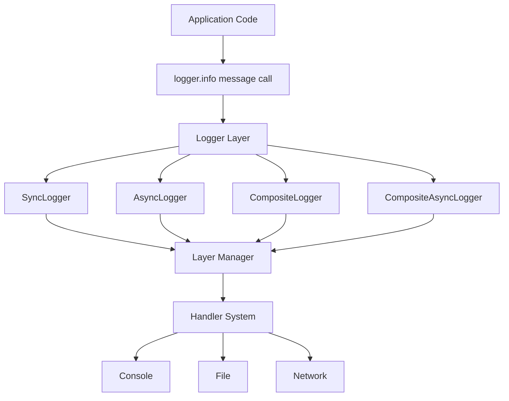

# HYDRA-LOGGER

[](https://github.com/SavinRazvan/hydra-logger/actions/workflows/ci.yml)
[](https://github.com/SavinRazvan/hydra-logger/blob/main/setup.py)
[](https://codecov.io/gh/SavinRazvan/hydra-logger)
[](https://github.com/SavinRazvan/hydra-logger/blob/main/LICENSE)
[](https://pypi.org/project/hydra-logger/)
[](https://pepy.tech/projects/hydra-logger)

`hydra-logger` is a modular Python logging library for teams that need configurable logging without coupling application code to fixed transports or formats.

## Overview

Core capabilities:
- Sync, async, and composite logger types
- Layer-based routing with per-layer destinations and levels
- Console, file, network, and null handlers
- Plain text, colored, JSON lines, and structured formats
- Optional extensions (for example security and performance)

Design principles:
- Keep implementation simple and maintainable
- Favor configuration over hardcoded behavior
- Keep module boundaries explicit and extensible

## Install

```bash
pip install hydra-logger
```

Core install includes only required baseline dependencies. Optional integrations are
installed through extras, for example:

```bash
pip install "hydra-logger[network]"
pip install "hydra-logger[perf]"
pip install "hydra-logger[database,cloud,queues]"
pip install "hydra-logger[full]"
```

Development environment:

```bash
# Option A (venv)
python3 -m venv .hydra_env
source .hydra_env/bin/activate
python -m pip install --upgrade pip setuptools wheel
python -m pip install -e .[dev]
python -m pip install pyright

# Option B (Conda prefix)
conda env create -p ./.hydra_env -f environment.yml
source "$(conda info --base)/etc/profile.d/conda.sh"
conda activate "$(pwd)/.hydra_env"
```

Environment maintenance and troubleshooting are documented in `docs/ENVIRONMENT_SETUP.md`.

## Quick Start

```python
from hydra_logger import LoggingConfig, LogLayer, LogDestination, create_logger

config = LoggingConfig(
    layers={
        "app": LogLayer(
            destinations=[
                LogDestination(type="console", format="colored", use_colors=True),
                LogDestination(type="file", path="app.log", format="json-lines"),
            ]
        )
    }
)

with create_logger(config, logger_type="sync") as logger:
    logger.info("Application started", layer="app")
    logger.warning("Low memory", layer="app")
    logger.error("Database connection failed", layer="app")
```

Async variant:

```python
import asyncio
from hydra_logger import create_async_logger


async def main():
    async with create_async_logger("MyAsyncApp") as logger:
        logger.info("Async logging works")
        logger.warning("Async warning message")


asyncio.run(main())
```

## Configuration

Format configuration:

```python
config = LoggingConfig(
    layers={
        "app": LogLayer(
            destinations=[
                LogDestination(type="console", format="json", use_colors=True),
                LogDestination(type="file", path="app.log", format="plain-text"),
                LogDestination(type="file", path="app_structured.jsonl", format="json-lines"),
            ]
        )
    }
)
```

Destination configuration:

```python
config = LoggingConfig(
    layers={
        "api": LogLayer(
            destinations=[
                LogDestination(type="console", format="colored"),
                LogDestination(type="file", path="api.log", format="json-lines"),
            ]
        )
    }
)
```

Typed network destination configuration (FastAPI-style DX):

```python
config = LoggingConfig(
    layers={
        "webhook": LogLayer(
            destinations=[
                LogDestination(
                    type="network_http",
                    url="https://logs.example.com/ingest",
                    timeout=5.0,
                    retry_count=3,
                    retry_delay=0.5,
                )
            ]
        ),
        "streaming": LogLayer(
            destinations=[
                LogDestination(
                    type="network_ws",
                    url="wss://stream.example.com/events",
                    timeout=10.0,
                    retry_count=5,
                    retry_delay=1.0,
                )
            ]
        ),
    }
)
```

Network migration guidance:

- Prefer explicit typed destinations: `network_http`, `network_ws`, `network_socket`, `network_datagram`.
- Legacy `network` remains transitional and is mapped to `network_http` when `url` is provided.
- Update legacy `network` configs incrementally to typed variants to avoid future deprecation friction.

Extension configuration:

```python
config = LoggingConfig(
    enable_data_protection=True,
    extensions={
        "data_protection": {
            "enabled": True,
            "type": "security",
            "patterns": ["email", "phone", "api_key"],
        }
    }
)
```

Optional async runtime queue mode (opt-in, default behavior unchanged):

```python
config = LoggingConfig(
    layers={
        "default": LogLayer(destinations=[LogDestination(type="async_file", path="app.jsonl")])
    },
    extensions={
        "async_runtime": {
            "mode": "queue",              # default is task scheduling mode
            "worker_count": 2,            # async queue workers
            "max_queue_size": 20000,      # bounded queue for backpressure
            "overflow_policy": "drop_newest",  # drop_newest | drop_oldest | block_with_timeout
            "put_timeout_seconds": 0.01,  # used when overflow_policy=block_with_timeout
        }
    },
)
```

Enterprise hardening profile (strict reliability is opt-in and does not change default template behavior):

```python
from hydra_logger.config.defaults import get_enterprise_config

config = get_enterprise_config()
# Highlights:
# - strict_reliability_mode=True
# - reliability_error_policy="warn"
# - enforce_log_path_confinement=True
# - allow_absolute_log_paths=False
```

Log file location policy:

- `hydra_logger` does not create log directories on import/install.
- Log directories are created only when file destinations are configured and initialized.
- Default behavior (no `base_log_dir`) writes to `<current working directory>/logs`.
- For strict confinement to project-owned paths, set:

```python
config = LoggingConfig(
    base_log_dir="logs",
    enforce_log_path_confinement=True,
    allow_absolute_log_paths=False,
)
```

## Architecture

System flow (high-level):



Detailed architecture and workflow documentation:
- `docs/ARCHITECTURE.md`
- `docs/WORKFLOW_ARCHITECTURE.md`
- `docs/modules/README.md`

## Operations

Quality and validation commands:

```bash
# Environment preflight
.hydra_env/bin/python scripts/dev/check_env_health.py --strict

# Test gate
.hydra_env/bin/python -m pytest -q

# Run all examples
.hydra_env/bin/python examples/run_all_examples.py

# Performance benchmark
.hydra_env/bin/python benchmark/performance_benchmark.py

# Runtime guard (forbid blocking runtime calls in hydra_logger)
.hydra_env/bin/python -m pytest tests/quality/test_runtime_blocking_calls.py -q
```

Enterprise tutorial tracks:

```bash
.hydra_env/bin/python examples/tutorials/t01_production_quick_start.py
.hydra_env/bin/python examples/tutorials/t03_layers_customization.py
.hydra_env/bin/python examples/tutorials/t04_extensions_plugins.py
.hydra_env/bin/python examples/tutorials/t07_operational_playbook.py
```

## Documentation

- `docs/ARCHITECTURE.md`
- `docs/WORKFLOW_ARCHITECTURE.md`
- `docs/modules/README.md`
- `docs/PERFORMANCE.md`
- `docs/OPERATIONS.md`
- `docs/RELEASE_CHECKLIST.md`
- `docs/plans/`
- `docs/audit/`
- `CHANGELOG.md`
- `examples/README.md`
- `examples/tutorials/README.md`

## Contributing

- Keep changes focused and maintain backward compatibility for public APIs
- Add or update tests in `tests/` for behavior changes
- Update docs when behavior or public interfaces change
- Run `pre-commit` and `python -m pytest -q` before opening a PR
- Run release preflight before tagging/publishing: `.hydra_env/bin/python scripts/release/preflight.py`
- Follow `docs/RELEASE_CHECKLIST.md` for release evidence and final gate order

## License

MIT. See `LICENSE`.
