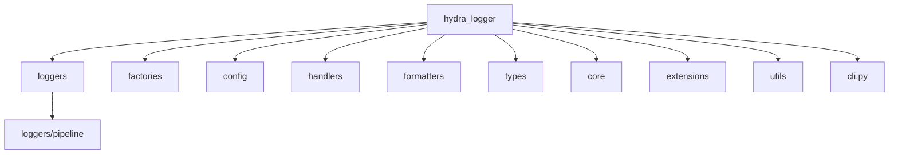
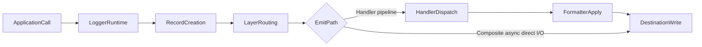

# Hydra-Logger Architecture

This document provides the canonical high-level architecture view of Hydra-Logger.

Detailed package behavior, exports, and maintenance guidance now live in `docs/modules/`.

## Canonical References

- Module index: [`modules/README.md`](modules/README.md)
- Workflow details: [`WORKFLOW_ARCHITECTURE.md`](WORKFLOW_ARCHITECTURE.md)
- Performance context: [`PERFORMANCE.md`](PERFORMANCE.md)
- Module audit and coverage: [`modules/MODULE_COVERAGE_MATRIX.md`](modules/MODULE_COVERAGE_MATRIX.md)

## Architecture Summary

Hydra-Logger is organized as a modular package with distinct runtime layers:

- Logger runtimes (`loggers`) receive calls and create records.
- Logger pipeline components (`loggers/pipeline`) perform record building, routing, extension processing, and handler dispatch.
- Configuration models (`config`) describe layers and destinations.
- Handlers (`handlers`) deliver payloads to output targets.
- Formatters (`formatters`) serialize records into destination-specific formats.
- Core utilities and contracts (`core`, `types`, `utils`, `extensions`) support runtime behavior.
- Factories (`factories`) provide stable constructor APIs.
- CLI entrypoint (`cli.py`) exposes command-line orchestration.

## Package Topology

## Runtime Data Path

## Module Documentation Map

| Domain | Canonical Page |
|---|---|
| Root package exports and bootstrap behavior | `docs/modules/root-package.md` |
| Logger runtimes and lifecycle behavior | `docs/modules/loggers.md` |
| Destination handling and delivery model | `docs/modules/handlers.md` |
| Formatting model and selection behavior | `docs/modules/formatters.md` |
| Configuration hierarchy and templates | `docs/modules/config.md` |
| Core constants, exceptions, and managers | `docs/modules/core.md` |
| Factory entry points and constructor flows | `docs/modules/factories.md` |
| Types, enums, and record contracts | `docs/modules/types.md` |
| Extension lifecycle and security processing | `docs/modules/extensions.md` |
| Shared utility support layer | `docs/modules/utils.md` |

## Documentation Ownership Rule

When architecture details change in code:

1. Update the relevant `docs/modules/*.md` page first.
2. Update this document only when high-level topology or data path changes.
3. Refresh `docs/modules/MODULE_COVERAGE_MATRIX.md` to capture drift and coverage status.
