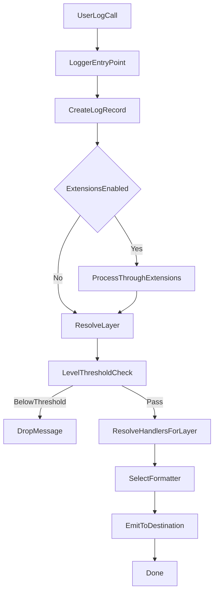
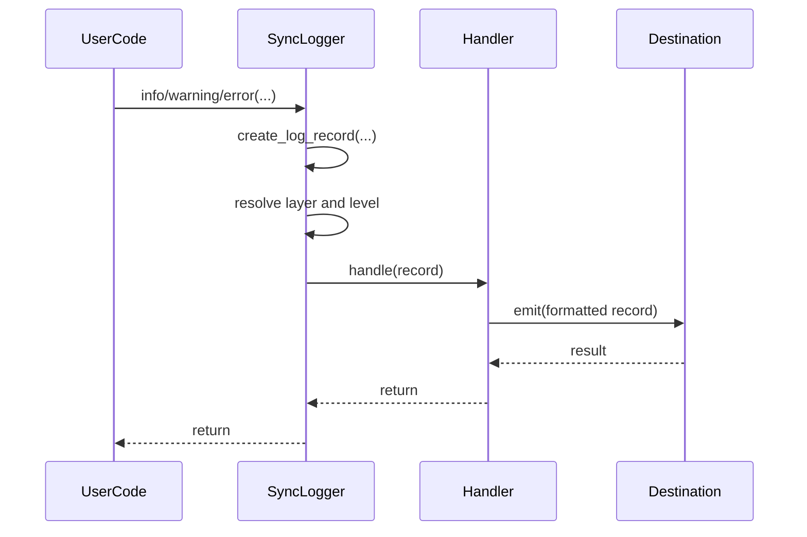
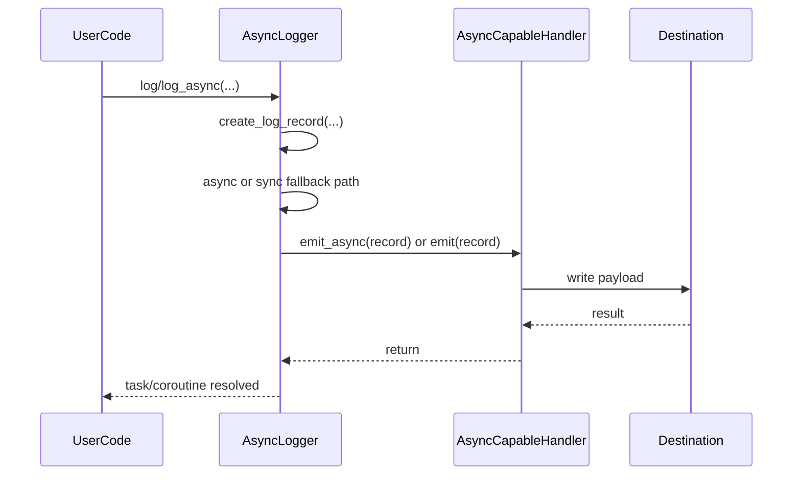
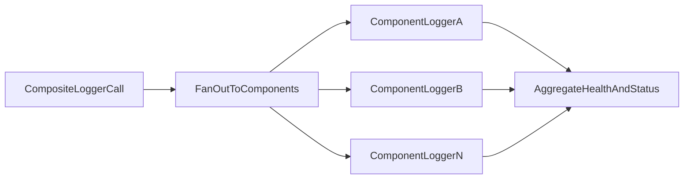
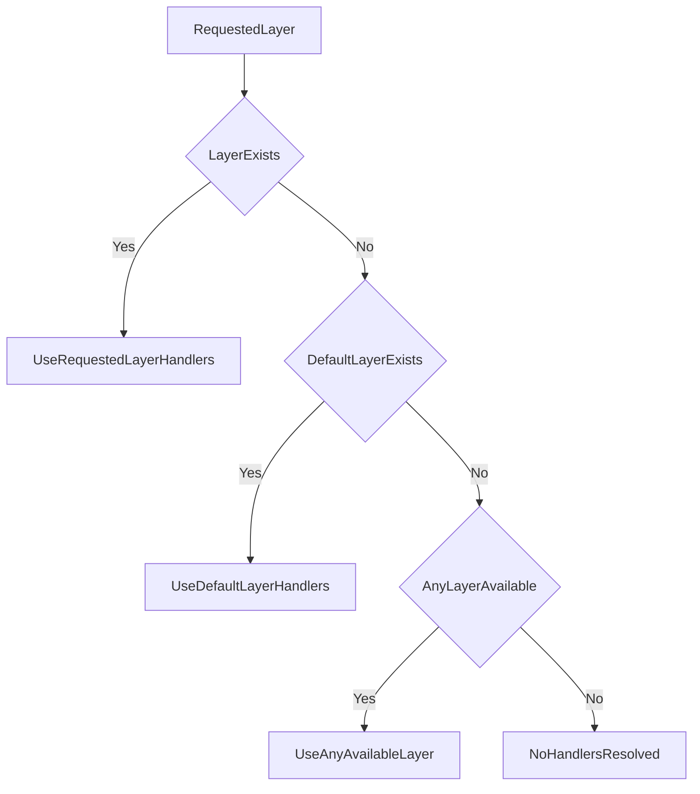
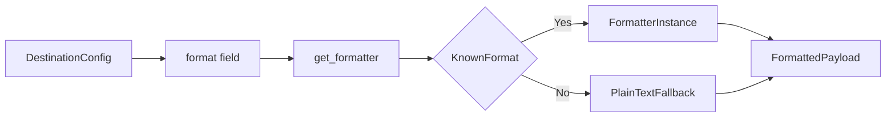
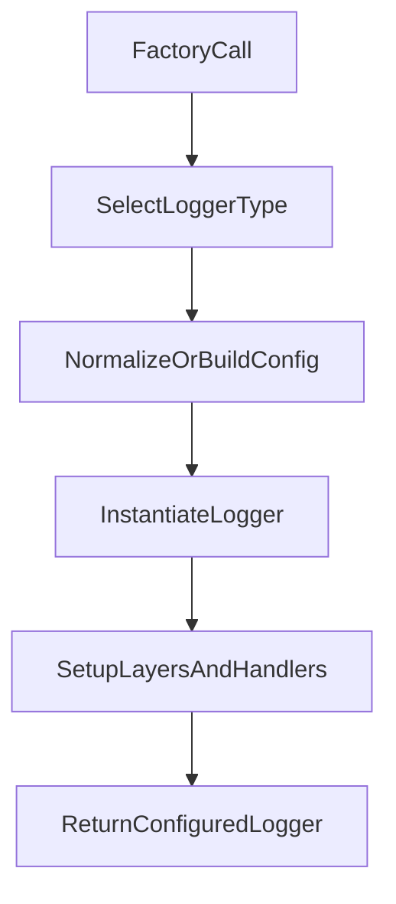
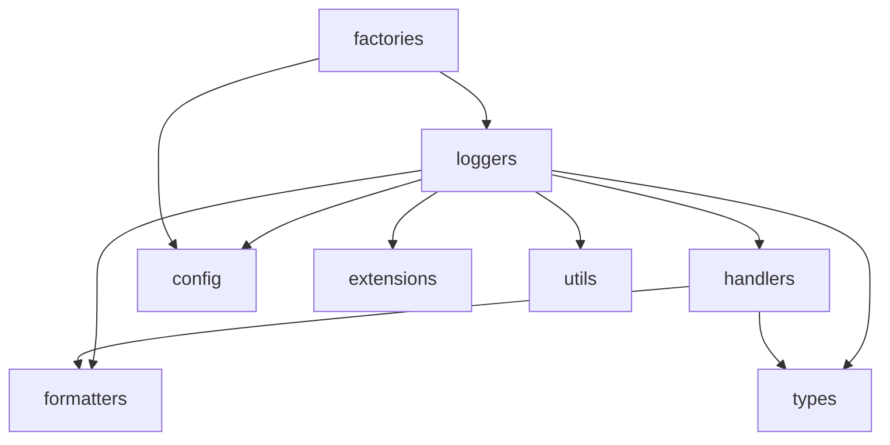

# Hydra-Logger Workflow Architecture

This document describes runtime workflows and interaction boundaries.

For module-level ownership and symbol detail, use `docs/modules/README.md`.

## Workflow Scope

- Logging call path (sync, async, composite variants)
- Layer routing and destination dispatch
- Formatter selection behavior
- Extension processing points
- Factory-to-runtime instantiation path

## End-To-End Logging Pipeline

## Logger Variant Workflows

### SyncLogger

### AsyncLogger

### Composite Logger Family

## Layer Routing Workflow

## Formatter Selection Workflow

## Factory Workflow

## Cross-Module Interaction Map

## Maintenance Rules

- Treat `docs/modules/*.md` as canonical for module behavior and export details.
- Update this workflow document only when execution flow changes.
- Keep diagrams synchronized with current logger, handler, formatter, and factory behavior.
