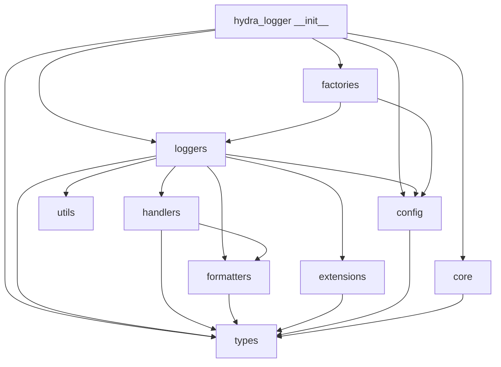

# Hydra-Logger Module Documentation

This section is the source of truth for package-level documentation in `hydra_logger/`.

Use it for onboarding, impact analysis, and safe refactoring.

## Goals

- Keep documentation aligned with the real Python package layout.
- Make ownership and update points explicit for each module.
- Provide workflow-level Mermaid diagrams for faster onboarding.
- Enable repeatable docs maintenance as the code evolves.

## Standard Page Contract

Each module page in this folder should include:

1. Scope
2. Responsibilities
3. Key files
4. Public API/export surface (if applicable)
5. Runtime workflow (Mermaid)
6. Caveats and known gaps
7. Maintenance checklist

## Module Index

- [`root-package.md`](root-package.md) - top-level API exports in `hydra_logger/__init__.py`.
- [`loggers.md`](loggers.md) - logger implementations and lifecycle behavior.
- [`handlers.md`](handlers.md) - destination handlers and delivery semantics.
- [`formatters.md`](formatters.md) - formatting pipelines and output formats.
- [`config.md`](config.md) - configuration models and template mechanisms.
- [`core.md`](core.md) - constants, exceptions, layer and logger management.
- [`factories.md`](factories.md) - logger creation and factory-facing APIs.
- [`types.md`](types.md) - record, level, context, and enum type system.
- [`extensions.md`](extensions.md) - extension interfaces and security extension surface.
- [`utils.md`](utils.md) - utility helpers used across modules.
- [`module-governance.md`](module-governance.md) - docs maintenance workflow and quality gates.

## Package Dependency View

## How To Use This Docs Set

1. Start with `root-package.md` to understand public entry points.
2. Move to `loggers.md` and `config.md` for runtime behavior.
3. Follow links to `handlers.md` and `formatters.md` for output flow.
4. Use `module-governance.md` before PR merge to keep docs synchronized.

## Module Tracking Snapshot

| Module | Page | Status |
|---|---|---|
| root package | `root-package.md` | maintained |
| loggers | `loggers.md` | maintained |
| handlers | `handlers.md` | maintained |
| formatters | `formatters.md` | maintained |
| config | `config.md` | maintained |
| core | `core.md` | maintained |
| factories | `factories.md` | maintained |
| types | `types.md` | maintained |
| extensions | `extensions.md` | maintained |
| utils | `utils.md` | maintained |
