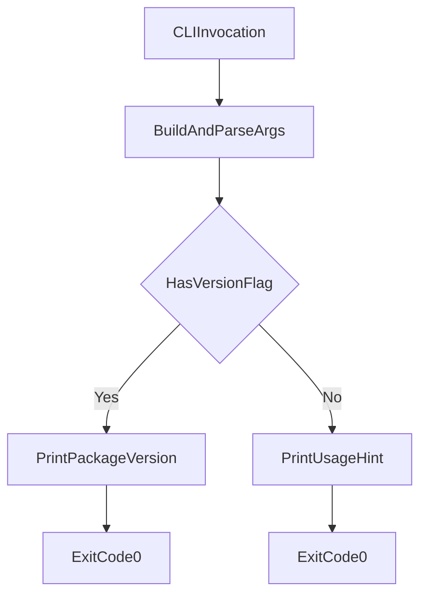

# CLI Module (`hydra_logger/cli.py`)

## Scope

Defines the package CLI entrypoint exposed by the `hydra-logger` console script.

## Responsibilities

- Parse lightweight command-line arguments.
- Expose package version with `--version`.
- Return deterministic process exit codes without side effects.

## Key File

- `hydra_logger/cli.py` - parser creation and `main()` entrypoint.

## Runtime Behavior

## Public Surface

- `main(argv: list[str] | None = None) -> int`

## Caveats

- CLI intentionally stays minimal; feature-rich operational workflows live in `scripts/`.
- CLI output is informational and does not mutate repository state.

## Maintenance Notes

- Keep CLI imports lightweight so `hydra-logger --version` remains fast and reliable.
- Ensure behavior remains side-effect free to support packaging and health checks.
