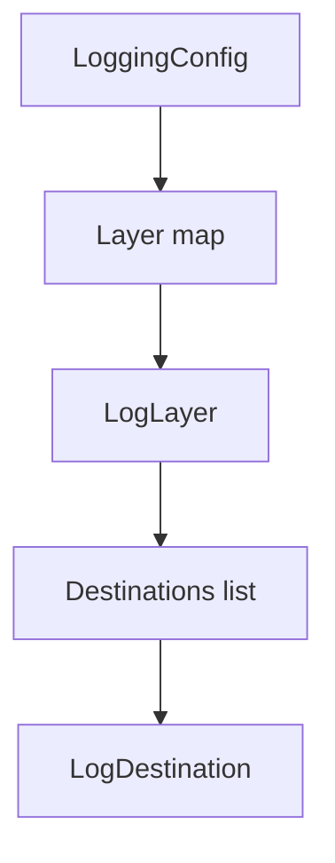
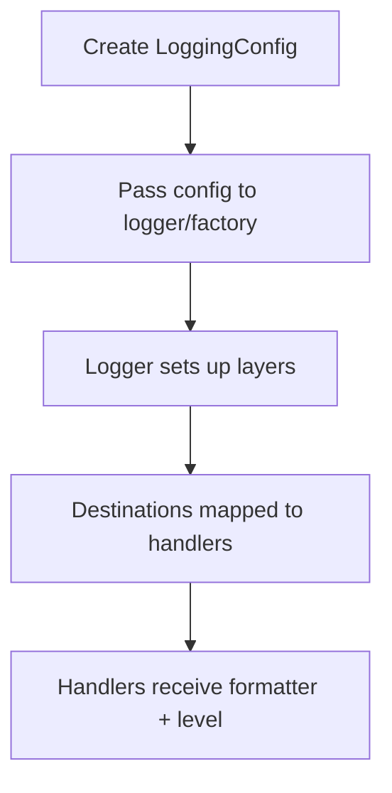

# Config Module (`hydra_logger/config`)

## Scope

Defines configuration models and template helpers used to build logger/runtime configuration.

## Responsibilities

- Define schema and defaults for logger runtime behavior.
- Model layer/destination relationships.
- Provide template and helper entry points for common setups.

## Key Files

- `models.py` - schema objects (`LoggingConfig`, `LogLayer`, `LogDestination`, and related configs).
- `defaults.py` - default/template helper utilities.
- `configuration_templates.py` - template registry and lookup helpers.
- `__init__.py` - exported config API surface.

## Configuration Hierarchy

## Configuration To Runtime Path

## Caveats

- `config/__init__.py` currently advertises symbols that are not implemented in the package tree; treat exported API as implementation-verified, not docstring-verified.

## Public Surface (module-level)

- Core schema: `LoggingConfig`, `LogLayer`, `LogDestination`
- Additional config models from `models.py`
- Template/default helpers from `defaults.py` and `configuration_templates.py`

## Maintenance Notes

- After schema changes in `models.py`, update examples in README and module docs.
- Re-check template names and defaults against real template registry functions.

## Maintenance Checklist

- [ ] Schema fields in docs match `models.py`.
- [ ] Template names and registry behavior are current.
- [ ] Exported symbols in `config/__init__.py` are validated against bound names.
