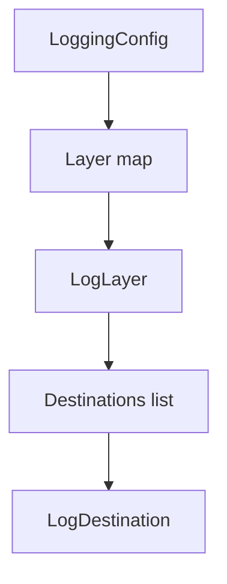
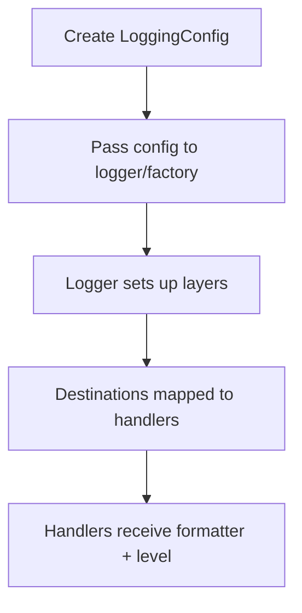

# Config Module (`hydra_logger/config`)

## Scope

Defines configuration models and template helpers used to build logger/runtime configuration.

## Responsibilities

- Define schema and defaults for logger runtime behavior.
- Model layer/destination relationships.
- Provide template and helper entry points for common setups.

## Key Files

- `models.py` - schema objects (`LoggingConfig`, `LogLayer`, `LogDestination`, and related configs).
- `defaults.py` - default/template helper utilities.
- `configuration_templates.py` - template registry and lookup helpers.
- `__init__.py` - exported config API surface.

## Configuration Hierarchy



## Configuration To Runtime Path



## Caveats

- `async_cloud` is maintained as a schema-level integration point; database/queue async sink fields are reserved for custom or future integrations and are not built-in handler families.
- Typed network destination variants are first-class in `LogDestination`:
  - `network_http` (`url` required, scheme `http|https`)
  - `network_ws` (`url` required, scheme `ws|wss`)
  - `network_socket` (`host` + `port` required)
  - `network_datagram` (`host` + `port` required)
- Legacy `network` remains a transitional alias that maps to `network_http` when `url` is provided and emits a deprecation warning.

## Network Destination Examples

```python
from hydra_logger.config.models import LoggingConfig, LogDestination, LogLayer

config = LoggingConfig(
    layers={
        "http": LogLayer(
            destinations=[
                LogDestination(
                    type="network_http",
                    url="https://logs.example.com/ingest",
                    timeout=5.0,
                    retry_count=3,
                    retry_delay=0.5,
                )
            ]
        ),
        "websocket": LogLayer(
            destinations=[
                LogDestination(
                    type="network_ws",
                    url="wss://stream.example.com/events",
                    timeout=10.0,
                    retry_count=5,
                    retry_delay=1.0,
                )
            ]
        ),
    }
)
```

## Public Surface (module-level)

- Core schema: `LoggingConfig`, `LogLayer`, `LogDestination`
- Additional config models from `models.py`
- Template/default helpers from `defaults.py` and `configuration_templates.py`

## Maintenance Notes

- After schema changes in `models.py`, update examples in README and module docs.
- Re-check template names and defaults against real template registry functions.

## Maintenance Checklist

- [ ] Schema fields in docs match `models.py`.
- [ ] Template names and registry behavior are current.
- [ ] Exported symbols in `config/__init__.py` are validated against bound names.
- [ ] Destination and integration fields are clearly marked as built-in vs custom/roadmap.
