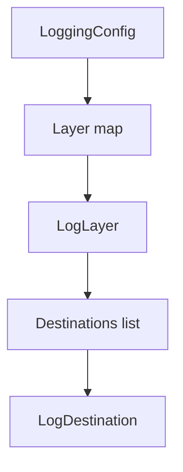
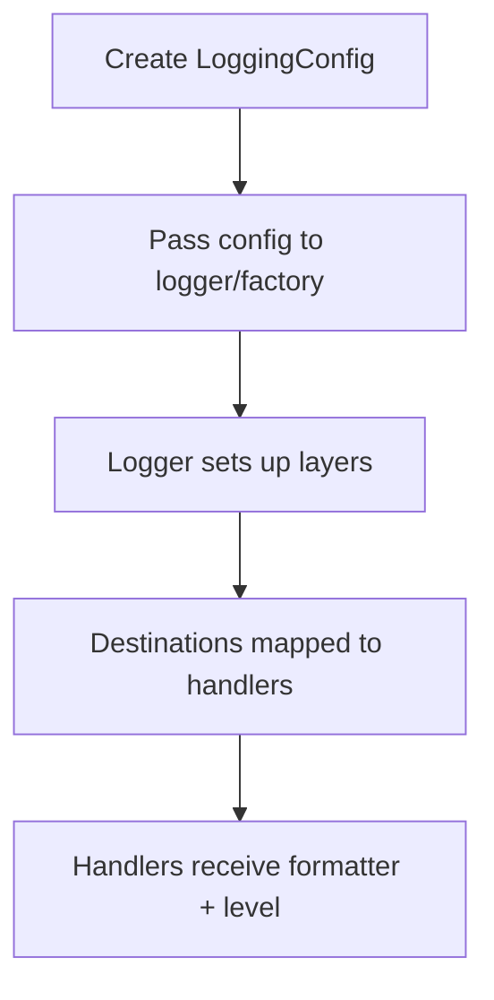

# Config Module (`hydra_logger/config`)

## Scope

Defines configuration models and template helpers used to build logger/runtime configuration.

## Responsibilities

- Define schema and defaults for logger runtime behavior.
- Model layer/destination relationships.
- Provide template and helper entry points for common setups.

## Key Files

- `models.py` - canonical Pydantic schema (`LoggingConfig`, handler sub-configs, destination fields, extensions block).
- `layers.py` / `destinations.py` - `LogLayer` and `LogDestination` model modules (re-exported from `hydra_logger.config`).
- `runtime.py` - thin re-export of `LoggingConfig` (stable import path for package layout).
- `loader.py` - load and validate config from disk (YAML; JSON accepted when it parses via `yaml.safe_load`, same schema; `extends`, optional cache, strict unknown fields).
- `validation.py` - validation helpers used by schema/runtime paths.
- `defaults.py` - named presets (`get_default_config`, `get_development_config`, `get_production_config`, `get_named_config`, `ConfigurationTemplates`, `templates`, …). Module-level **`get_enterprise_config()`** also lives here (see README); it is **not** listed on `hydra_logger.config.__all__` — import from `hydra_logger.config.defaults` or use `get_named_config` / template registry as appropriate.
- `configuration_templates.py` - named template registry (`register_configuration_template`, `list_configuration_templates`, …).
- `__init__.py` - **canonical** submodule public API (`__all__`); keep in sync with this page.

## Configuration Hierarchy



## Configuration To Runtime Path



## File-based YAML / JSON (enterprise path)

Load a validated `LoggingConfig` once at startup (not per log line). **JSON** files work for the same schema because the
loader uses `yaml.safe_load` (typical JSON is valid YAML 1.2). Prefer **YAML** when using **`extends`**.

```python
from pathlib import Path

from hydra_logger import create_sync_logger
from hydra_logger.config.loader import load_logging_config

config = load_logging_config(Path("config/logging.yaml"))
logger = create_sync_logger(config, name="app")

# or keyword-only:
logger = create_sync_logger(config_path=Path("config/logging.yaml"), name="app")
```

YAML features:

- **`extends`**: path or list of paths (relative to the including file) merged before validation; depth and graph size are capped (see `load_logging_config` docstring).
- **`hydra_config_schema_version`**: optional integer field on the root model for migration tracking.
- **`strict_unknown_fields=True`**: fail on unknown top-level keys when loading.

Network destinations may set:

- **`http_payload_encoder`**: registered name for a Python-side encoder (see `docs/plans/config-from-path-enterprise.md`).
- **`http_batch_size` / `http_batch_flush_interval`**: optional batching for HTTP sinks.
- **`use_real_websocket_transport`** (for `network_ws` only): when `True`, `WebSocketHandler` uses real WebSocket I/O (requires the `network` extra / `websockets`). Default remains simulated transport for config-driven `network_ws` until this flag is set.

Canonical design notes: [`plans/config-from-path-enterprise.md`](../plans/config-from-path-enterprise.md).

## Caveats

- `async_cloud` is maintained as a schema-level integration point; database/queue async sink fields are reserved for custom or future integrations and are not built-in handler families.
- Typed network destination variants are first-class in `LogDestination`:
  - `network_http` (`url` required, scheme `http|https`)
  - `network_ws` (`url` required, scheme `ws|wss`)
  - `network_socket` (`host` + `port` required)
  - `network_datagram` (`host` + `port` required)
- Legacy `network` remains a transitional alias that maps to `network_http` when `url` is provided and emits a deprecation warning.

## Network Destination Examples

```python
from hydra_logger.config import LoggingConfig, LogDestination, LogLayer

config = LoggingConfig(
    layers={
        "http": LogLayer(
            destinations=[
                LogDestination(
                    type="network_http",
                    url="https://logs.example.com/ingest",
                    timeout=5.0,
                    retry_count=3,
                    retry_delay=0.5,
                )
            ]
        ),
        "websocket": LogLayer(
            destinations=[
                LogDestination(
                    type="network_ws",
                    url="wss://stream.example.com/events",
                    timeout=10.0,
                    retry_count=5,
                    retry_delay=1.0,
                )
            ]
        ),
    }
)
```

## Public Surface (`hydra_logger.config` / `config/__init__.py`)

Aligned with `__all__` in code:

- **Loaders:** `load_logging_config`, `clear_logging_config_cache`
- **Core models:** `LoggingConfig`, `LogLayer`, `LogDestination`
- **Handler config models:** `HandlerConfig`, `FileHandlerConfig`, `ConsoleHandlerConfig`, `MemoryHandlerConfig`, `ModularConfig`
- **Defaults / presets:** `ConfigurationTemplates`, `get_default_config`, `get_custom_config`, `get_development_config`, `get_production_config`, `get_named_config`, `list_available_configs`, `templates`
- **Template registry:** `configuration_templates`, `register_configuration_template`, `get_configuration_template`, `list_configuration_templates`, `has_configuration_template`, `validate_configuration_template`

Top-level `hydra_logger` re-exports the most common subset (`LoggingConfig`, `LogLayer`, `LogDestination`, `ConfigurationTemplates`, loaders); use `hydra_logger.config` for the full template/registry surface.

## Maintenance Notes

- After schema changes in `models.py`, update examples in README and module docs.
- Re-check template names and defaults against real template registry functions.

## Maintenance Checklist

- [ ] Schema fields in docs match `models.py`.
- [ ] Template names and registry behavior are current.
- [ ] Exported symbols in `config/__init__.py` are validated against bound names.
- [ ] Destination and integration fields are clearly marked as built-in vs custom/roadmap.
