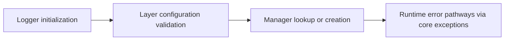

# Core Module (`hydra_logger/core`)

## Scope

Provides foundational constants, exceptions, and runtime management helpers.

## Responsibilities

- Centralize core exceptions and constants.
- Provide layer/logger management primitives used by higher modules.
- Keep internal control-plane semantics consistent across runtime types.

## Key Files

- `constants.py` - shared constants/enums used by runtime components.
- `exceptions.py` - exception hierarchy for logger/config/handler errors.
- `layer_management.py` - layer routing and layer configuration objects.
- `logger_management.py` - logger lookup/manager style helpers.
- `base.py` - base runtime constructs used by internals.
- `__init__.py` - core exports.

## Control Plane Flow

## Public Surface (`hydra_logger.core` / `core/__init__.py`)

- Constants: `Colors`, `LogLevel`, `QueuePolicy`, `ShutdownPhase` (`LogLevel` here is the **same** type re-exported from `hydra_logger.types.levels` for convenience)
- Layer management: `LayerManager`, `LayerConfiguration`
- Exceptions: `HydraLoggerError`, `ConfigurationError`, `ValidationError`, `HandlerError`, `FormatterError`, `PluginError`, `SecurityError`

**Not** exported from `hydra_logger.core`: `getLogger`, `getSyncLogger`, `getAsyncLogger`. Those live in `hydra_logger.core.logger_management` and are re-exported from the **root** package (`import hydra_logger` / `hydra_logger/__init__.py`) only.

## Caveats And Known Gaps

- Core module docstrings can drift toward internal implementation details; treat `core/__init__.py` exports as the canonical **`hydra_logger.core`** surface. For “everything users import from `hydra_logger`”, use `root-package.md` and `hydra_logger/__init__.py`.

## Maintenance Notes

- Keep core exceptions stable; external callers may catch them directly.
- Sync naming with `hydra_logger/__init__.py` re-exports when adding/removing symbols.

## Maintenance Checklist

- [ ] Exception hierarchy changes are documented.
- [ ] Exported constants and manager helpers are synchronized with root exports.
- [ ] Layer-management behavior changes are reflected in logger docs.
