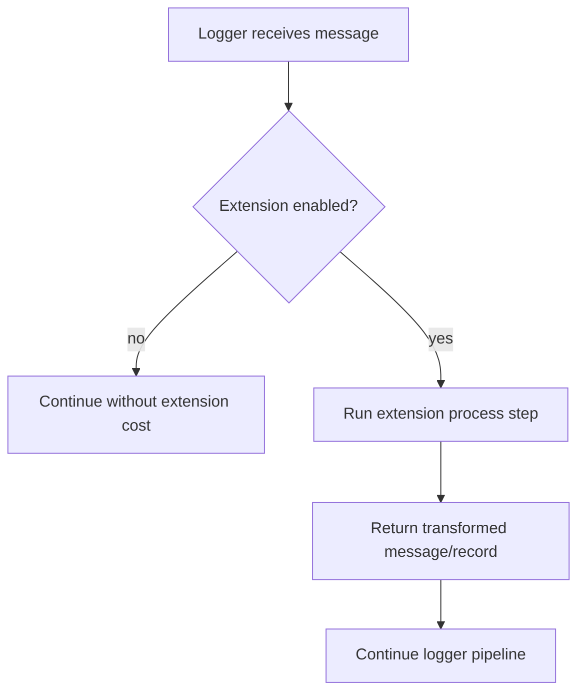

# Extensions Module (`hydra_logger/extensions`)

## Scope

Extension interfaces and extension manager plumbing, including security-related extension support.

## Responsibilities

- Define extension interfaces and base behaviors.
- Coordinate extension execution order and enable/disable semantics.
- Provide security-focused extension entry points under `extensions/security`.

## Key Files

- `base.py` and `extension_base.py` - extension classes and concrete extension types.
- `extension_manager.py` - extension coordination.
- `security/data_redaction.py` - redaction-focused security extension.
- `__init__.py` and `security/__init__.py` - export surfaces.

## Extension Processing Flow

## Public Surface (module-level)

- `ExtensionBase`
- `Extension`
- `ExtensionConfig`
- `SecurityExtension`
- `FormattingExtension`
- `PerformanceExtension`
- `ExtensionManager`

## Caveats And Known Gaps

- Extension docs should reflect exported classes in `extensions/__init__.py`; avoid documenting non-exported extension variants as stable API.

## Maintenance Notes

- Keep extension API contracts stable (`process`, enable/disable semantics).
- When adding extension types, update config docs and security onboarding notes.

## Maintenance Checklist

- [ ] Extension exports in `extensions/__init__.py` are current.
- [ ] Security extension behavior remains aligned with logger integration docs.
- [ ] Any new extension type has corresponding config and module docs updates.
