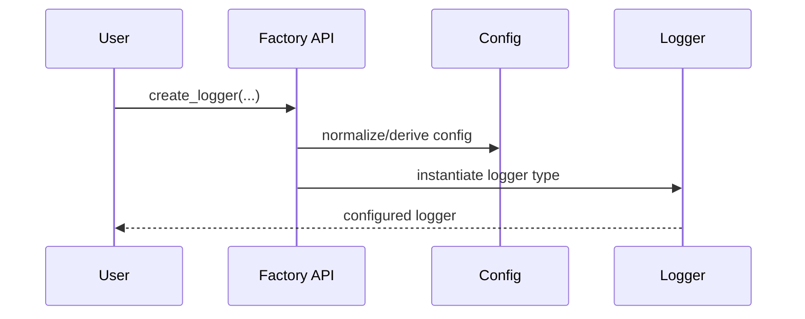

# Factories Module (`hydra_logger/factories`)

## Scope

Centralized logger construction APIs for sync/async/composite variants.

## Responsibilities

- Offer consistent creation APIs for all logger runtime types.
- Normalize construction-time arguments and configuration defaults.
- Keep top-level and submodule factory surfaces aligned.

## Key Files

- `logger_factory.py` - implementation of creation functions.
- `__init__.py` - public factory exports.

## Factory Workflow

## Public Factory Surface

- `create_logger`
- `create_sync_logger`
- `create_async_logger`
- `create_composite_logger`
- `create_composite_async_logger`
- default/dev/prod/custom helper creators

## Caveats And Known Gaps

- Factory naming must remain aligned across `hydra_logger/__init__.py` and `hydra_logger/factories/__init__.py` to avoid fragmented user entry points.

## Maintenance Notes

- Keep factory argument contracts consistent with README and examples.
- Validate that new logger types are reachable through top-level and module-level factory exports.

## Maintenance Checklist

- [ ] Factory function names and signatures are documented and current.
- [ ] New logger types are exposed via factory and root package exports.
- [ ] README examples still use valid factory APIs.
