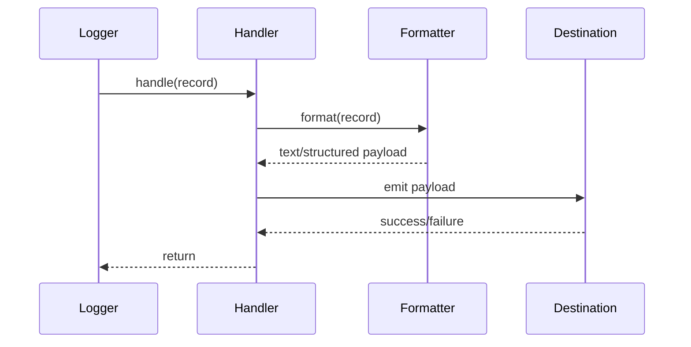

# Handlers Module (`hydra_logger/handlers`)

## Scope

Delivers formatted log records to destinations (console, file, network, null, rotating variants).

## Responsibilities

- Enforce handler-level filtering and dispatch.
- Apply formatter output before writing to destinations.
- Provide sync/async delivery contracts for logger integrations.

## Key Files

- `base_handler.py` - base handler contract.
- `console_handler.py` - sync/async console output.
- `file_handler.py` - file-based handlers.
- `network_handler.py` - network transport handlers and protocols.
- `rotating_handler.py` - file rotation strategies.
- `null_handler.py` - no-op sink.
- `__init__.py` - exported handler classes and config enums.

## Delivery Flow

## Current Supported Families

- Console handlers.
- File handlers (including rotating file handlers).
- Network handlers.
- Null handler.

## Public Surface (module-level)

- Base: `BaseHandler`
- Console: `SyncConsoleHandler`, `AsyncConsoleHandler`
- File/rotation: `FileHandler`, `RotatingFileHandler`, `TimedRotatingFileHandler`, `SizeRotatingFileHandler`, `HybridRotatingFileHandler`
- Network: `BaseNetworkHandler`, `HTTPHandler`, `WebSocketHandler`, `SocketHandler`, `DatagramHandler`, `NetworkHandlerFactory`
- Network configs/policies: `NetworkConfig`, `NetworkProtocol`, `RetryPolicy`
- Rotation/time configs: `RotationConfig`, `RotationStrategy`, `TimeUnit`
- Utility: `NullHandler`

## Caveats And Known Gaps

- Historical docs may still mention database/queue/cloud/system handlers; those are not part of the current module implementation.

### Network handlers

- **HTTP**: connectivity uses a configurable probe (`NetworkConfig.connection_probe`,
  `NetworkConfig.probe_method` / `LogDestination.connection_probe`, `LogDestination.probe_method`).
  Default probe verb is **GET** for backward compatibility; prefer **HEAD** or **`none`** when ingest
  endpoints reject GET.
- **WebSocket**: default mode is a **simulated** transport (stats only) with a one-time
  `UserWarning` on first `emit`. Set **`use_real_websocket_transport=True`** and install
  the **`network`** extra (`websockets`) to use the synchronous `websockets.sync.client`
  path for real frames (JSON payload per emit). Connection lifecycle follows handler
  `close()` semantics.
- **Diagnostics**: `AsyncFileHandler` routes operational messages through
  `hydra_logger.utils.internal_diagnostics` (logger `hydra_logger.internal`, `NullHandler` by default)
  instead of stdout/stderr.

## Maintenance Notes

- Keep handler-level filtering and formatter assignment explicit.
- If destination types are added/removed, sync docs in `config.md` and `loggers.md`.

## Maintenance Checklist

- [ ] Handler family list matches `handlers/__init__.py`.
- [ ] Formatter binding behavior is still accurate.
- [ ] Destination-type changes are reflected in config and logger docs.
