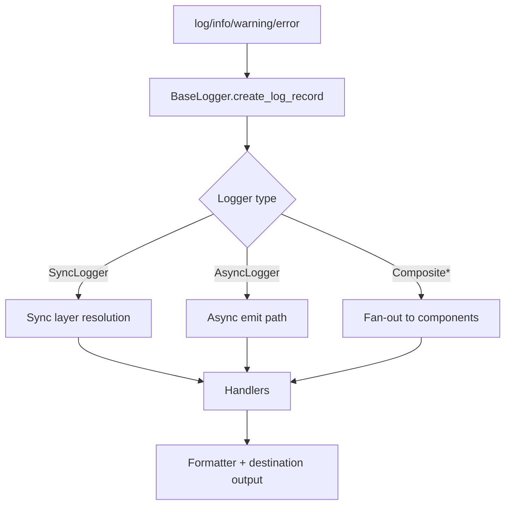

# Loggers Module (`hydra_logger/loggers`)

## Scope

Implements logger runtimes: synchronous, asynchronous, and composite forms.

## Responsibilities

- Create `LogRecord` instances through shared base behavior.
- Route records to layer-specific handlers.
- Provide sync and async lifecycle/cleanup semantics.
- Expose high-level logging methods (`debug` through `critical`).

## Key Files

- `base.py` - abstract logger contract and shared lifecycle behavior.
- `sync_logger.py` - sync logging path, layer routing, and handler dispatch.
- `async_logger.py` - async logging path and async/sync fallback behavior.
- `composite_logger.py` - fan-out logger patterns for multiple components.
- `pipeline/record_builder.py` - hot-path record construction service.
- `pipeline/layer_router.py` - layer resolution and routing service.
- `pipeline/handler_dispatcher.py` - destination dispatch orchestration.
- `pipeline/extension_processor.py` - extension execution in logging flow.
- `pipeline/component_dispatcher.py` - composite component fan-out dispatch.
- `__init__.py` - module export surface and convenience `getLogger()`.

## Runtime Flow

## Key Behaviors

- `BaseLogger` centralizes performance profile selection for record creation.
- `SyncLogger` applies per-layer threshold checks before dispatching handlers.
- `AsyncLogger` supports async contexts, queue-runtime mode, and sync fallback behavior.
- Composite loggers coordinate multiple logger instances and aggregate health; composite async defaults to a direct-I/O path unless configured otherwise.

## Public Surface (module-level)

- `BaseLogger`
- `SyncLogger`
- `AsyncLogger`
- `CompositeLogger`
- `CompositeAsyncLogger`
- record creation strategy helpers from `hydra_logger.types.records`

## Caveats

- Some logger docstrings describe legacy capabilities; rely on implementation and exports, not historical narrative comments.
- Composite async internals include direct I/O buffering logic; evaluate carefully before changing defaults.

## Maintenance Notes

- After editing any logger file, re-check method parity for `debug/info/warning/error/critical`.
- Verify close/cleanup behavior for both sync and async context managers.

## Maintenance Checklist

- [ ] Logger method parity is preserved across implementations.
- [ ] Layer routing behavior is documented and unchanged, or docs are updated.
- [ ] Context-manager close semantics still match implementation.
