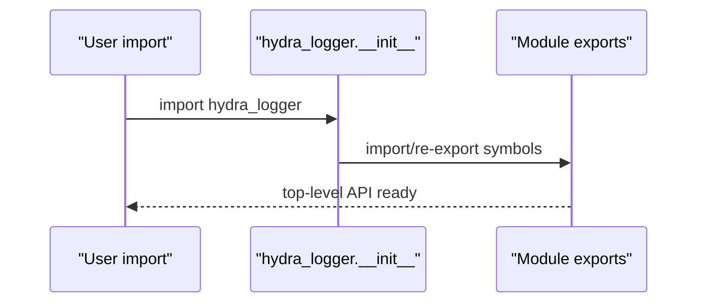

# Root Package (`hydra_logger`)

## Scope

Defines top-level exports and package bootstrap behavior in `hydra_logger/__init__.py`.

## Key Responsibilities

- Expose the primary public API for users.
- Re-export stderr interception controls (`StderrInterceptor`, `start_stderr_interception`, `stop_stderr_interception`).
- Re-export logger classes, factories, config models, and exceptions.
- Preserve compatibility aliases (`HydraLogger`, `AsyncHydraLogger`).

## Public API Surface

Primary exported groups:

- Loggers: `SyncLogger`, `AsyncLogger`, `CompositeLogger`, `CompositeAsyncLogger`.
- Factories: `create_logger`, `create_sync_logger`, `create_async_logger`, `create_composite_logger`, `create_composite_async_logger`.
- Logger manager API: `getLogger`, `getSyncLogger`, `getAsyncLogger`.
- Config/types/exceptions: `LoggingConfig`, `LogDestination`, `LogLayer`, `ConfigurationTemplates`, `LogRecord`, `LogLevel`, `LogContext`, and core exception classes.
- Runtime controls and metadata: `StderrInterceptor`, `start_stderr_interception`, `stop_stderr_interception`, `__version__`, `__author__`, `__license__`.

## Caveats And Known Gaps

- Package docstring content is broader than implemented runtime surface and should not be treated as canonical architecture guidance.
- Importing `hydra_logger` does not start stderr interception automatically; callers must opt in with `start_stderr_interception()`.

## Initialization Flow

## Maintenance Notes

- Re-validate `__all__` when exports change.
- Keep compatibility aliases explicitly documented if retained.
- Keep top-level imports side-effect minimal; runtime controls remain explicit opt-in.

## Maintenance Checklist

- [ ] `__all__` matches exported symbols.
- [ ] Compatibility aliases are intentional and documented.
- [ ] Import-time bootstrap behavior remains safe and bounded.
