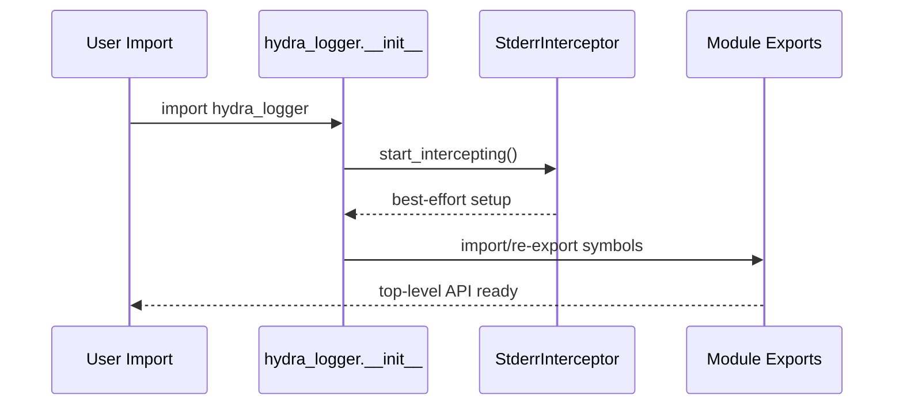

# Root Package (`hydra_logger`)

## Scope

Defines top-level exports and package bootstrap behavior in `hydra_logger/__init__.py`.

## Key Responsibilities

- Expose the primary public API for users.
- Start stderr interception early via `StderrInterceptor.start_intercepting()`.
- Re-export logger classes, factories, config models, and exceptions.
- Preserve compatibility aliases (`HydraLogger`, `AsyncHydraLogger`).

## Public API Surface

Primary exported groups:

- Loggers: `SyncLogger`, `AsyncLogger`, `CompositeLogger`, `CompositeAsyncLogger`.
- Factories: `create_logger`, `create_sync_logger`, `create_async_logger`, `create_composite_logger`, `create_composite_async_logger`.
- Logger manager API: `getLogger`, `getSyncLogger`, `getAsyncLogger`.
- Config/types/exceptions: `LoggingConfig`, `LogDestination`, `LogLayer`, `LogRecord`, `LogLevel`, `LogContext`, and core exception classes.

## Caveats And Known Gaps

- Package docstring content is broader than implemented runtime surface and should not be treated as canonical architecture guidance.
- Import-time stderr interception is best-effort by design and intentionally fails silently.

## Initialization Flow

## Maintenance Notes

- Re-validate `__all__` when exports change.
- Keep compatibility aliases explicitly documented if retained.
- Keep bootstrap side-effects minimal and safe (import-time failures must not break users).

## Maintenance Checklist

- [ ] `__all__` matches exported symbols.
- [ ] Compatibility aliases are intentional and documented.
- [ ] Import-time bootstrap behavior remains safe and bounded.
