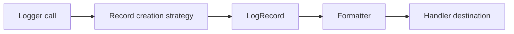

# Types Module (`hydra_logger/types`)

## Scope

Defines core data models and enums used across the logging pipeline.

## Responsibilities

- Provide stable record-level data contracts.
- Centralize log level and context utilities.
- Host enums shared by handlers, formatters, configuration, and runtime code.

## Key Files

- `records.py` - `LogRecord` and record-creation helpers.
- `levels.py` - log level constants/manager utilities.
- `context.py` - context-related models and detectors.
- `enums.py` - shared enums used by config/handlers/runtime.
- `__init__.py` - type exports.

## Data Model Flow

## Caveats

- `types/__init__.py` includes exports for `create_metadata`/`merge_metadata`, but those implementations are not present in current package files.

## Public Surface (module-level)

- Record APIs: `LogRecord`, `LogRecordBatch`
- Level APIs: `LogLevel`, `LogLevelManager`, level utility helpers
- Context APIs: `LogContext`, context support classes
- Enum families from `enums.py`

## Maintenance Notes

- Maintain strict compatibility for `LogRecord` fields used by formatters and handlers.
- Re-check enum usage when adding new destination or formatter types.

## Maintenance Checklist

- [ ] Export list in `types/__init__.py` maps to implemented symbols.
- [ ] `LogRecord` field compatibility is preserved.
- [ ] Enum additions/removals are reflected in dependent module docs.
