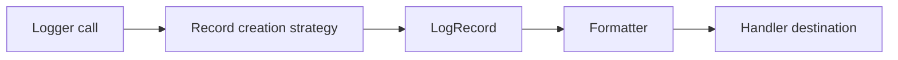

# Types Module (`hydra_logger/types`)

## Scope

Defines core data models and enums used across the logging pipeline.

## Responsibilities

- Provide stable record-level data contracts.
- Centralize log level and context utilities.
- Host enums shared by handlers, formatters, configuration, and runtime code.

## Key Files

- `records.py` - `LogRecord` and record-creation helpers.
- `levels.py` - log level constants/manager utilities.
- `context.py` - context-related models and detectors.
- `enums.py` - shared enums used by config/handlers/runtime.
- `__init__.py` - type exports.

## Data Model Flow

## Caveats

- The enum surface is broad and used across modules; treat removals/renames as cross-module changes requiring coordinated doc updates.
- **Name collision:** `hydra_logger.types.enums` defines an enum **`LogLayer`** (layer *kind* / taxonomy). **`hydra_logger.config.LogLayer`** is a **Pydantic model** for config layers. Use fully qualified imports in docs and app code when both appear.

## Public Surface (`hydra_logger.types` / `types/__init__.py`)

- **Records:** `LogRecord`, `LogRecordBatch`
- **Levels:** `LogLevel`, `LogLevelManager`, `get_level_name`, `get_level`, `is_valid_level`, `all_levels`, `all_level_names`
- **Context:** `LogContext`, `ContextType`, `CallerInfo`, `SystemInfo`, `ContextManager`, `ContextDetector`
- **Enums:** `HandlerType`, `FormatterType`, `PluginType`, `LogLayer` (enum), `SecurityLevel`, `QueuePolicy`, `ShutdownPhase`, `RotationStrategy`, `CompressionType`, `EncryptionType`, `NetworkProtocol`, `DatabaseType`, `CloudProvider`, `LogFormat`, `ColorMode`, `ValidationLevel`, `MonitoringLevel`, `ErrorHandling`, `AsyncMode`, `CacheStrategy`, `BackupStrategy`, `HealthCheckType`, `AlertSeverity`, `MetricType`, `TimeUnit`, `SizeUnit` (see `types/__init__.py` `__all__` for the authoritative list)

## Maintenance Notes

- Maintain strict compatibility for `LogRecord` fields used by formatters and handlers.
- Re-check enum usage when adding new destination or formatter types.

## Maintenance Checklist

- [ ] Export list in `types/__init__.py` maps to implemented symbols.
- [ ] `LogRecord` field compatibility is preserved.
- [ ] Enum additions/removals are reflected in dependent module docs.
