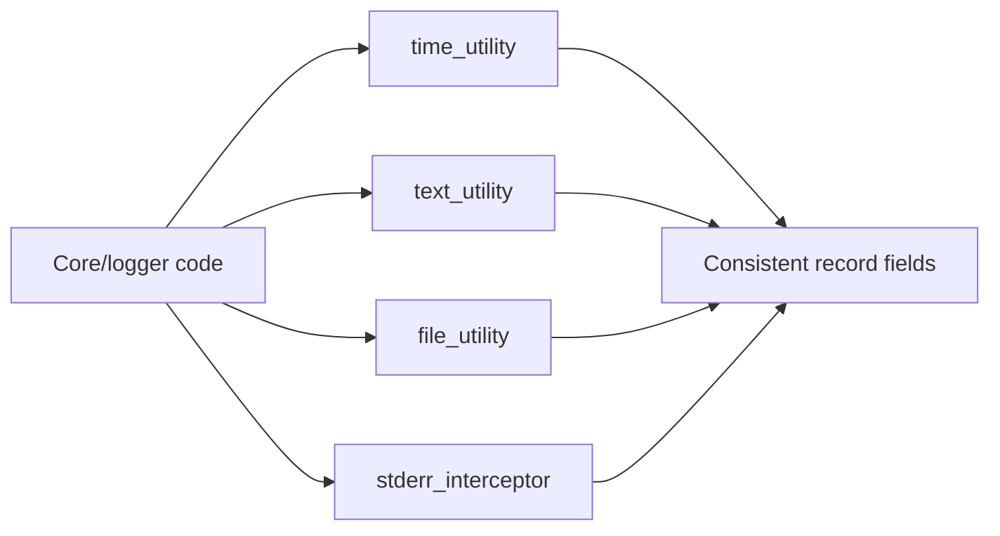

# Utils Module (`hydra_logger/utils`)

## Scope

Utility layer for text, time, file, stderr interception, system detection, and error logging helpers.

## Responsibilities

- Provide shared helpers used by multiple runtime modules.
- Keep core utility APIs lightweight and reusable.
- Isolate specialized bootstrap behavior in explicit utility modules.

## Key Files

- `text_utility.py` - text processing/validation helpers.
- `time_utility.py` - timestamps and time formatting helpers.
- `file_utility.py` - file/path utility helpers.
- `stderr_interceptor.py` - explicit stderr interception controls and interception runtime.
- `system_detector.py` - runtime environment/system detection.
- `error_logger.py` - internal error logging helpers.
- `__init__.py` - utility exports.

## Utility Usage Pattern

## Public Surface (module-level)

- Text helpers: `TextProcessor`, `TextFormatter`, `TextValidator`, `TextSanitizer`, `TextAnalyzer`
- Time helpers: `TimeUtility`, `TimestampFormatter`, `TimestampFormat`, `TimestampPrecision`, `TimestampConfig`, `DateFormatter`, `TimeZoneUtility`, `TimeRange`, `TimeInterval`
- File helpers: `FileUtility`, `PathUtility`, `FileValidator`, `FileProcessor`, `DirectoryScanner`

## Caveats And Known Gaps

- General utility exports are intentionally narrow; helpers outside `utils/__init__.py` should not be documented as public API unless explicitly exported.

## Maintenance Notes

- Avoid introducing side effects in general utilities beyond explicitly named bootstrap helpers.
- Keep utility imports lightweight because many runtime modules depend on them.

## Maintenance Checklist

- [ ] Utility exports remain focused and implementation-backed.
- [ ] New utility side effects are explicitly documented.
- [ ] Cross-module utility dependencies remain acyclic and lightweight.
