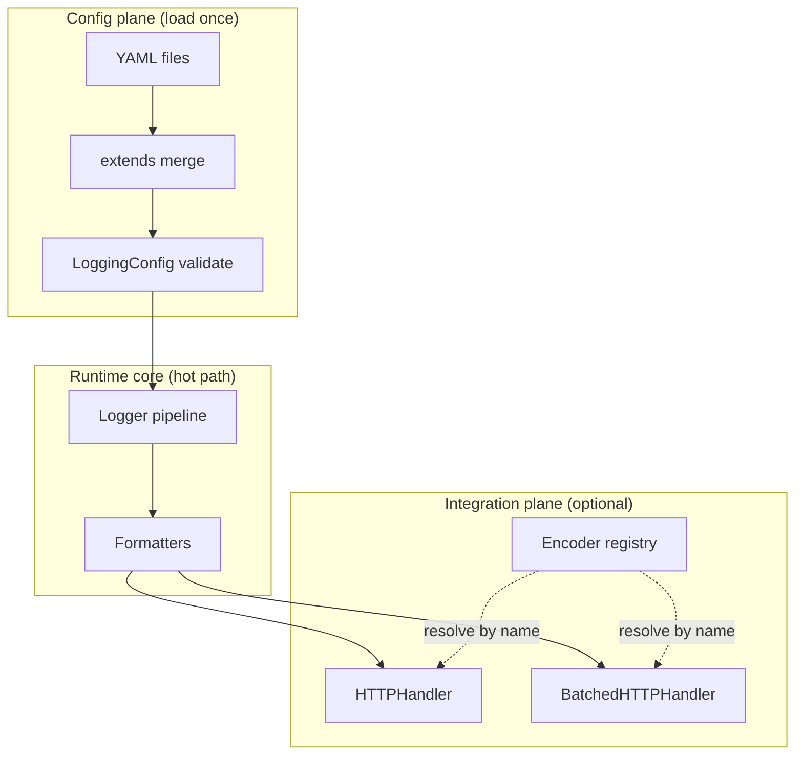

# Config from path, templates, and safe vendor hooks

**Status:** Implemented in library code (`hydra_logger.config.loader`, optional HTTP batching and payload encoders). This document is the enterprise-oriented design record.

## North star

One obvious way to run Hydra in production: **validated config → logger → logs**. Operators swap behavior by **changing the config file path** at process entry; advanced or vendor-specific wire formats are handled through **bounded, reviewable hooks** (never arbitrary code in YAML).

## Design principles (priority order)

| # | Principle | Outcome |
|---|-----------|---------|
| 1 | Performance by default | Hot path stays thin: no YAML parse, no file I/O, no plugin discovery per log line. |
| 2 | Modular boundaries | Config loading ≠ logger core ≠ network I/O ≠ optional extensions. |
| 3 | Easy to use | Few entrypoints: `load_logging_config(path)`, `create_sync_logger(config_path=...)`, named presets. |
| 4 | Plug in / out | Disable destinations, swap files, register named encoders in code—no fork. |
| 5 | Standardize | Single schema (`LoggingConfig`), optional `hydra_config_schema_version`, template packs under `examples/config/`. |

## Layered architecture

## File-based configuration

- YAML is parsed with **`yaml.safe_load` only** (no `!python/object`, no tags that execute code).
- Parsed documents are validated with **Pydantic** (`LoggingConfig`).
- **`extends`**: compose templates from other files (depth limit, cycle detection, node-count guard). Later files in a list override earlier ones; the current file overrides all parents.
- **`hydra_config_schema_version`**: optional integer on `LoggingConfig` for forward-compatible migrations (see `loader` docs).
- **`strict_unknown_fields=True`** in `load_logging_config`: rejects unknown top-level keys (stricter governance for reviewed configs).

## Performance stance

| Rule | Detail |
|------|--------|
| Load once | Load at startup or explicit reload—not per `log()` call. |
| Optional cache | `use_config_cache=True` caches by path + `mtime`. |
| Network | Sync HTTP is simple; for higher throughput use **`http_batch_size` / `http_batch_flush_interval`** on `network_http` destinations (batches JSON lines by default). |

## Security / governance

- **No executable YAML**: no import paths, no `eval`, no dynamic class names in config for handlers.
- **Secrets**: keep tokens out of VCS; prefer environment injection at deploy time (documented patterns in ops runbooks).
- **Encoders**: YAML may reference only a **registered name**; registration happens in **Python code** (or optional `importlib.metadata` entry points), so behavior is reviewable and testable.

## Escape hatches: custom HTTP bodies

Built-in `network_http` uses a default JSON envelope. When a vendor needs a different body (ndjson, protobuf, proprietary JSON), use one of these **patterns**:

### Pattern 1 — Subclass in application code

Subclass `BaseHandler` or `HTTPHandler` and implement `emit` with the exact wire format. **Pros:** full control, obvious in code review, no library changes. **Cons:** you own maintenance and compatibility.

### Pattern 2 — Registered payload encoder (named, in-process)

Implement a function registered with `register_http_payload_encoder("vendor_x", fn)` and set `http_payload_encoder: vendor_x` on the `LogDestination`. The function receives the `LogRecord` and optional formatter; return a `dict` (sent as JSON), `str`, or `bytes` (sent as body). **Pros:** keeps handler logic inside Hydra’s pipeline; YAML stays declarative. **Cons:** requires a small code module in the app or vendor package.

### Pattern 3 — Packaged discovery via entry points

Packages may expose encoders under the `hydra_logger.http_encoders` entry-point group. Call `load_http_encoders_from_entry_points()` once at startup (optional). **Pros:** plug-in distribution model for enterprises. **Cons:** operational visibility—teams should pin versions and audit entry-point modules.

## Phased roadmap (library)

| Phase | Deliverable |
|-------|-------------|
| P0 | `load_logging_config`, `create_*_logger(config_path=...)`, example YAMLs |
| P1 | `extends` with depth / cycle / size limits |
| P2 | `hydra_config_schema_version`, `strict_unknown_fields` |
| P3 | Optional `BatchedHTTPHandler` for `network_http` |
| P4 | Encoder registry + optional entry points |

## Non-goals

- Arbitrary code execution or handler class paths from YAML.
- Replacing structured logging standards (OpenTelemetry, etc.)—integrate at the edges if needed.
- Guaranteed delivery semantics for network sinks without explicit queueing infrastructure (batching improves throughput, not durability).

## Related code

- [`hydra_logger/config/loader.py`](../../hydra_logger/config/loader.py)
- [`hydra_logger/config/models.py`](../../hydra_logger/config/models.py) — `LoggingConfig`, `LogDestination`
- [`hydra_logger/handlers/http_payload_encoders.py`](../../hydra_logger/handlers/http_payload_encoders.py)
- [`hydra_logger/handlers/batched_http_handler.py`](../../hydra_logger/handlers/batched_http_handler.py)
- [`hydra_logger/factories/logger_factory.py`](../../hydra_logger/factories/logger_factory.py)
- Examples: [`examples/config/`](../../examples/config/)
